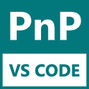
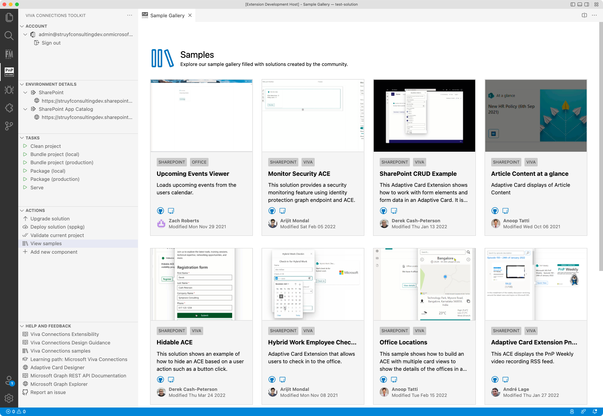
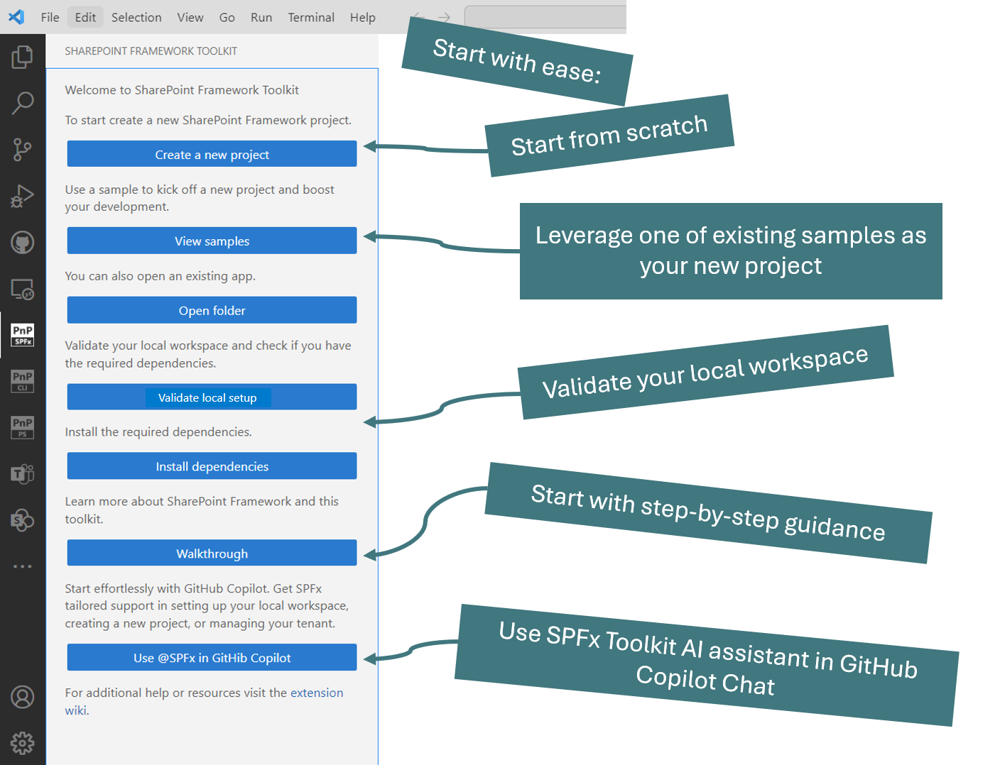
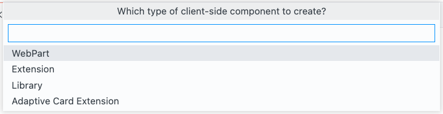

> ### Important: The extension is currently in preview. If you find issues, please report them to the [issue list](https://github.com/pnp/vscode-viva/issues).

 

<h1 align="center">
  
</h1>

# Viva Connections Toolkit for Visual Studio Code

With the Viva Connections Toolkit extension, you can create and manage your Viva Connections solutions on your tenant. All actions you need to perform during the development flow are at your fingertips. 

## Capabilities

The extension provides the following capabilities:

### Create a new Viva Connections app

The extension automatically detects if you are in an Viva Connections project (SharePoint Framework project). If not, it will show helpful actions to allow you to create a new Viva Connections app.

### Check the dependencies

To ensure that you can create Viva Connections Toolkit, you can use the **check dependencies** functionality. This action will check if you have the required dependencies to create a new Viva Connections app.

- Node version: 16
- NPM dependencies:
  - gulp
  - yo
  - @microsoft/generator-sharepoint

> **Info**: This list is based on the [set up your development environment recommendations](https://docs.microsoft.com/en-us/sharepoint/dev/spfx/set-up-your-development-environment)

### Installing the dependencies

In case when you do not have all dependencies installed, you can use the **install dependencies** action to install them.

### Start from a sample

From our sample gallery, you can quickly get started with one of the Viva Connections Toolkit that were created by the community.

### Create a new project

Creating a new project was never easier. Just use the **create a Viva Connections project** action, and the extension will guide you through the process.

### Project actions

When you open a Viva Connections app project (SharePoint Framework solution), you will be able to perform the following actions:

- Sign in and out to your tenant
- Run gulp tasks
- Upgrade the solution
- Deploy the solution
- Project validation
- Useful links to help you get started
- Add a new component to your project

  

## Contributing

This project welcomes contributions and suggestions. Most contributions require you to agree to a Contributor License Agreement (CLA) declaring that you have the right to grant us the right to use your contribution. For details, visit https://cla.microsoft.com.

When you submit a pull request, a CLA-bot will automatically determine whether you need to provide a CLA and decorate the PR appropriately (e.g., label, comment). Simply follow the instructions provided by the bot. You will only need to do this once across all repos using our CLA.

If you have ideas for new features or feedback, let us know by creating an issue in the [issues list](https://github.com/pnp/m365-hosted-apps-vscode/issues). Before you submit a PR with your improvements, please review our [contributing guide](./contributing.md).

## Code of Conduct

This project has adopted the [Microsoft Open Source Code of Conduct](https://opensource.microsoft.com/codeofconduct/).
For more information, see the [Code of Conduct FAQ](https://opensource.microsoft.com/codeofconduct/faq/) or contact [opencode@microsoft.com](mailto:opencode@microsoft.com) with any additional questions or comments.

## "Sharing is Caring"

## Disclaimer

**THIS CODE IS PROVIDED *AS IS* WITHOUT WARRANTY OF ANY KIND, EITHER EXPRESS OR IMPLIED, INCLUDING ANY IMPLIED WARRANTIES OF FITNESS FOR A PARTICULAR PURPOSE, MERCHANTABILITY, OR NON-INFRINGEMENT.**
