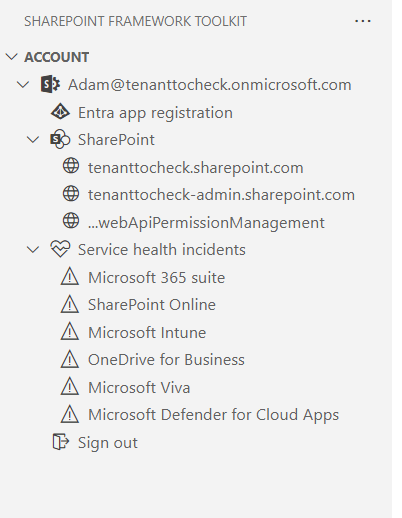

<h1 align="center">
  
</h1>

<h1 align="center">
  Viva Connections Toolkit for Visual Studio Code
</h1>

  

  

Viva Connections Toolkit is a Visual Studio Code extension that aims to boost your productivity in developing and managing SharePoint Framework solutions helping at every stage of your development flow, from setting up your development workspace to deploying a solution straight to your tenant without the need to leave VS Code.

  <a href="#%EF%B8%8F-architecture">Architecture</a> |
  <a href="#-capabilities">Capabilities</a> |
  <a href="#-wiki">Wiki</a> |
  <a href="#-contributing">Contributing</a> |
  <a href="#-support">Support</a> |
  <a href="#-code-of-conduct">Code of Conduct</a> |
  <a href="#-changelog">Changelog</a> |
  <a href="#-sharing-is-caring">Sharing is Caring</a> |
  <a href="#-additional-resources">Additional resources</a>

## ⚙️ Architecture

Viva Connections Toolkit for Visual Studio Code is an abstraction layer on top of the [SPFx](https://aka.ms/spfx) Yeoman generator and [CLI for Microsoft 365](https://pnp.github.io/cli-microsoft365/). All operations and actions are performed on the command line level using these two tools with the environment settings on your computer.

This means that the features and capabilities provided through this tool are available for any solution which has been built with SPFx.
 
## ⭐ Capabilities

The extension provides the following capabilities:

### 1️⃣ Welcome experience

The extension automatically detects if you are in a SharePoint Framework project. If not, it will show helpful actions to allow you to create a new SPFx or ACE solution.

Directly from this view, you may create a new project from scratch or from an existing web part, extension or ACE sample, or ACE scenario.

It is also possible to open an already existing project using Open folder button.

Last but not least it is possible to check your local workspace for the needed global dependencies to develop the SPFx project, like the correct Node version, gulp, yeoman etc., and install them if needed with a single click.

### 2️⃣ Set up your development environment

To ensure that you can develop SPFx solutions, in Viva Connections Toolkit you may use the **check dependencies** functionality. 

This action will check if you have the required dependencies to create a new Viva Connections app.

- Node version: 16 or 18
- NPM dependencies:
  - gulp
  - yo
  - @microsoft/generator-sharepoint

In case when you do not have all dependencies installed, you can use the **install dependencies** action to install them.

> **Info**: This list is based on the [set up your development environment recommendations](https://docs.microsoft.com/en-us/sharepoint/dev/spfx/set-up-your-development-environment)

### 3️⃣ Don't Start from scratch. Reuse an SPFx (web part or extension) or ACE sample

From one of the samples gallery, you can kick-start your development with a new project. Create a new SPFx web part Extension or ACE solution with a click of a button. The samples are coming from [PnP Samples repo](https://pnp.github.io/sp-dev-fx-webparts/samples/type/).

Check out how easy it is to create a new project based on a web part sample 👇. 

Or ACE sample 👇.

### 4️⃣ Start from an ACE scenario

Start your solution based on the provided set of ACE scenarios with ready-to-use code to showcase what's possible. Scenarios are provided with detailed guidance using the [Code Tour](https://aka.ms/codetour) to provide you with more details on the structure and options.

### 5️⃣ Create a new project

Creating a new project was never easier. Just use the **create a new project** action, and the extension will guide you through the process.

Check it out 👇.

It's possible to scaffolding any kind of SPFx project.

### 6️⃣ Login to your tenant & retrieve environment details

The extension also allows you to log in to your Microsoft 365 tenant using CLI for Microsoft 365.

Thanks to that the extension will retrieve helpful URLs from your tenant like the link to SharePoint main site and tenant level App Catalog as well as site level.

Login-in is also required for some actions to work properly like the deploy action which allows to upload of the .sppkg file to the tenant or site-level App Catalog.

Additionally, when an SPFx project is opened the extension will check serve.json file and suggest updating it to set the initialPage property based on the currently logged-in tenant.

### 7️⃣ Gulp tasks

One of the sections of the extension shows all possible Gulp tasks one may run on an SPFx project. The tasks allow you to clean, bundle, package, serve the project with a single click.

### 8️⃣ Actions

The actions section allows unique functionalities that may significantly boost productivity when working with SPFx projects.

Currently the extension allows you to:

- **Upgrade project** - Uses CLI for Microsoft 365 to create a .md report with upgrade guidance to the latest supported SPFx version by the extension. [Check out our docs for more details](https://github.com/pnp/vscode-viva/wiki/4.6-Actions#upgrade-project)

- **Validate current project** - Creates a validation .md report against the currently used SPFx version in the project. The action will automatically detect the SPFx version used and will validate if the project is properly set up. [Check out our docs for more details](https://github.com/pnp/vscode-viva/wiki/4.6-Actions#validate-current-project)

- **Rename current project** - Forget about manual work and let the extension rename your project and generate a new solution ID. [Check out our docs for more details](https://github.com/pnp/vscode-viva/wiki/4.6-Actions#rename-current-project)

- **Grant API permissions** - The action will Grant all API permissions specified in the package-solution.json of the current project. This is especially helpful if you just want to debug your SPFx solution using Workbench. No longer do you need to bundle, package, and deploy the project to then go to the SharePoint admin portal and consent to the permissions. All of that is now done with just a single click. [Check out our docs for more details](https://github.com/pnp/vscode-viva/wiki/4.6-Actions#grant-api-permissions)

- **Deploy project** - This action will only work when the user is logged in to tenant and the sppkg file is present. The action will deploy the project to the selected (tenant or site) app catalog. [Check out our docs for more details](https://github.com/pnp/vscode-viva/wiki/4.6-Actions#deploy-project)

- **Add new component** - Allows scaffolding a new SPFx project as a new component of the currently opened project. The action under the hood uses the same SharePoint Yeoman generator to scaffold a new project and this feature is an abstraction UI layer. [Check out our docs for more details](https://github.com/pnp/vscode-viva/wiki/4.6-Actions#add-new-component)

- **CI/CD GitHub Workflow** - This action will allow you to generate yaml GitHub workflow that uses CLI for Microsoft 365 GitHub actions to bundle, package, and deploy your project to an app catalog on every code push. [Check out our docs for more details](https://github.com/pnp/vscode-viva/wiki/4.6-Actions#cicd-github-workflow)

- **Open sample/scenario galleries of the SPFx web part, extensions, or ACEs projects** - Viva Connections Toolkit supports a couple of sample galleries that may be used to scaffold a new SPFx project. [Check out our docs for more details](https://github.com/pnp/vscode-viva/wiki/4.6-Actions#open-samplescenario-galleries-of-the-spfx-web-part-extensions-or-aces-projects)

### 9️⃣ Help and feedback section

The help and feedback section is a group of links that will redirect the user to documentation, learning paths, ACE designer, MS Graph Explorer, PnP Discord channel, Viva Connections Toolkit repo, and many more.

### 1️⃣0️⃣ Coding Snippets

The Viva Connections Toolkit comes together as a bundle with two other extensions. One of them is [SPFx Snippets](https://marketplace.visualstudio.com/items?itemName=eliostruyf.spfx-snippets) created by [Elit Struyf](https://www.eliostruyf.com/). 

It contains snippets for working in:

- JavaScript (resource files)
- React
- SASS (SCSS)
- TypeScript
- JSON

In order to start using it simply start typing from `spfx-` and you should see a full list of snippets that will inject code into the current file.

Check out the extension [details to find out more](https://github.com/estruyf/vscode-spfx-snippets#usage) 

Check it out in action 👇

## 📚 Wiki 

For more information on how to use the extension, please refer to the [wiki](https://github.com/pnp/vscode-viva/wiki).

## 👩‍💻 Contributing

This project welcomes contributions and suggestions. Most contributions require you to agree to a Contributor License Agreement (CLA) declaring that you have the right to grant us the right to use your contribution. For details, visit https://cla.microsoft.com.

When you submit a pull request, a CLA-bot will automatically determine whether you need to provide a CLA and decorate the PR appropriately (e.g., label, comment). Simply follow the instructions provided by the bot. You will only need to do this once across all repos using our CLA.

If you have ideas for new features or feedback, let us know by creating an issue in the [issues list](https://github.com/pnp/vscode-viva/issues). Before you submit a PR with your improvements, please review our [contributing guide](./contributing.md).

## 🙋 Support

This project is a community lead extension provided by the [Microsoft 365 and Power Platform Community](https://aka.ms/m365/community) members. Microsoft employees are closely involved in this work, but the solution is provided under the community brand without direct supportability channels from Microsoft.

## 👍 Community

Are you building experiences for Microsoft 365? - Everyone is welcome to join our [Microsoft 365 and Power Platform Community](https://aka.ms/m365/community) efforts with community calls, samples and guidance. Join our [weekly community calls](https://aka.ms/m365/calls) for Microsoft 365 and Power Platform topics or engage with us on [Discord](https://aka.ms/community/discord). Everyone is welcome 🧡

## 🧾 Code of Conduct

This project has adopted the [Microsoft Open Source Code of Conduct](https://opensource.microsoft.com/codeofconduct/).
For more information, see the [Code of Conduct FAQ](https://opensource.microsoft.com/codeofconduct/faq/) or contact [opencode@microsoft.com](mailto:opencode@microsoft.com) with any additional questions or comments.

## 📄 Changelog

See the [changelog](./CHANGELOG.md) for the latest changes.

## 😍 "Sharing is Caring"

<h1 align="center">
  
</h1>

## 🔍 Additional resources

- Join the [Microsoft 365 Developer Program](https://developer.microsoft.com/en-us/microsoft-365/dev-program) today to get your free Microsoft 365 tenant
- Join the [Microsoft 365 and Power Platform Community](https://pnp.github.io/) community and engage with us on [Discord](https://aka.ms/community/discord)

## ⚠️ Disclaimer

**THIS CODE IS PROVIDED *AS IS* WITHOUT WARRANTY OF ANY KIND, EITHER EXPRESS OR IMPLIED, INCLUDING ANY IMPLIED WARRANTIES OF FITNESS FOR A PARTICULAR PURPOSE, MERCHANTABILITY, OR NON-INFRINGEMENT.**
