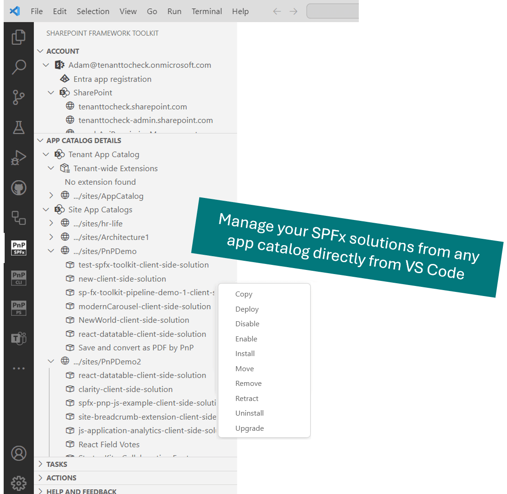
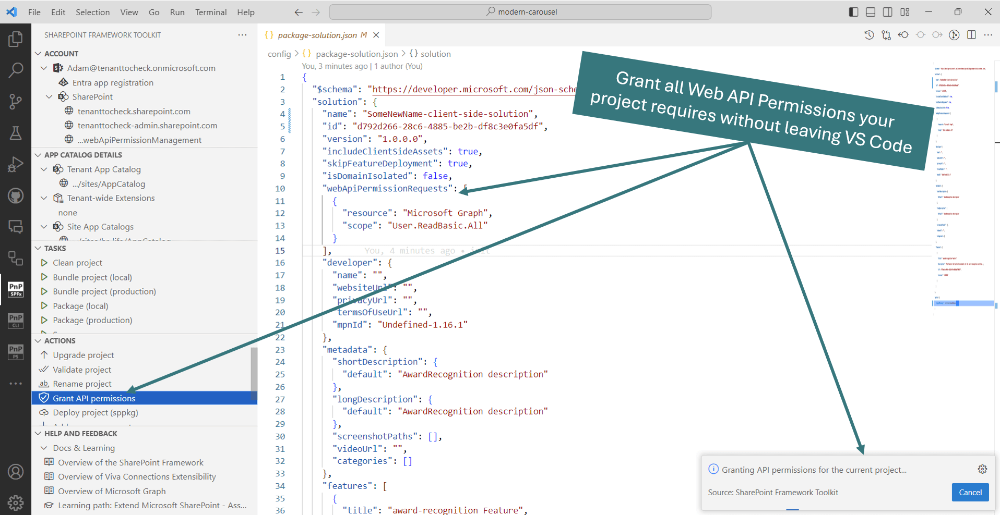
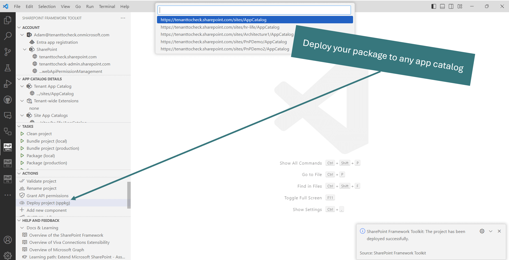
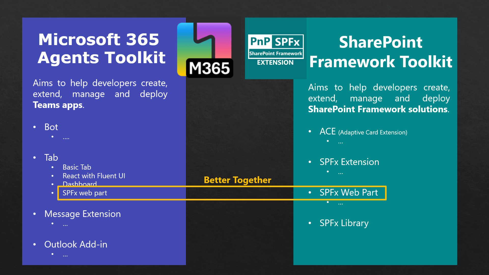

<h1 align="center">
  
</h1>

<h1 align="center">
  SharePoint Framework Toolkit for Visual Studio Code
</h1>

  

  

SharePoint Framework Toolkit is a Visual Studio Code extension that aims to boost your productivity in developing and managing SharePoint Framework solutions helping at every stage of your development flow, from setting up your development workspace to deploying a solution straight to your tenant without the need to leave VS Code. With SharePoint Framework, you can use modern web technologies and tools in your preferred development environment to build productive experiences and apps that are responsive and mobile-ready allowing you to create solutions to extend SharePoint, Microsoft Teams, Microsoft Viva Connections, Outlook and Microsoft365.com.

  <a href="#-capabilities">Capabilities</a> |
  <a href="#%EF%B8%8F-architecture">Architecture</a> |
  <a href="#-wiki">Wiki</a> |
  <a href="#-contributing">Contributing</a> |
  <a href="#-support">Support</a> |
  <a href="#-code-of-conduct">Code of Conduct</a> |
  <a href="#-changelog">Changelog</a> |
  <a href="#-sharing-is-caring">Sharing is Caring</a> |
  <a href="#-additional-resources">Additional resources</a>

## ⭐ Capabilities

The extension provides the following capabilities:

### 1️⃣ Welcome experience

The extension automatically detects if you have a SharePoint Framework project opened. If not, it will start with a welcome experience that will guide you through the process of creating a new project and validating your local environment.

Directly from this view, you may create a new project from scratch or from an existing web part, extension or ACE sample, or ACE scenario.

It is also possible to open an already existing project using Open folder button.

Last but not least it is possible to check your local workspace for the needed global dependencies to develop the SPFx solutions, like the correct Node version, gulp, yeoman etc., and install them if needed with a single click.

When running the extension for the first time it will present you a walkthrough that will give you a step-by-step guide to get started with SharePoint Framework development and will go over the main functionalities of SharePoint Framework (SPFx) Toolkit.

[Check out our docs for more details](https://github.com/pnp/vscode-viva/wiki/4-Welcome-experience)

### 2️⃣ Set up your development environment

To ensure that you can develop SPFx solutions, you may use the **check dependencies** functionality. 

This action will check if you have the required dependencies such as:

- Node version: 18
- NPM dependencies:
  - gulp
  - yo
  - @microsoft/generator-sharepoint

In case you do not have all dependencies installed, or some are incorrect version, you can use the **install dependencies** action to install them.

>  [!NOTE]
>  The list of valid dependencies is based on [set up your development environment recommendations](https://docs.microsoft.com/en-us/sharepoint/dev/spfx/set-up-your-development-environment)

[Check out our docs for more details](https://github.com/pnp/vscode-viva/wiki/5.1-Validate-and-set-up-a-local-workspace)

### 3️⃣ Don't Start from scratch. Reuse an SPFx web part or extension or ACE sample

You may kick-start your development with a new project based on an existing ACE or SPFx web part or extension with a click of a button. All of the provided samples are powered by [PnP Samples repositories](https://pnp.github.io/sp-dev-fx-webparts/samples/type/).

The extension provides a set of filters to help you find the right sample for your needs. You may search by: author, title, description, SPFx version, and component type. It is also possible browse sample details view directly from VS Code checking all sample details before you create a new project.

Switch between the list and grid view and don't worry about the size of your VS Code as it is fully responsive.

Check out how easy it is to create a new project based on a existing sample 👇. 

[Check out our docs for more details](https://github.com/pnp/vscode-viva/wiki/5.2-Scaffolding#2-dont-start-from-scratch---sample-galleries)

### 4️⃣ Start from an ACE scenario

Start your solution based on the provided set of ACE scenarios with ready-to-use code to showcase what's possible. Scenarios are provided with detailed guidance using the [Code Tour](https://aka.ms/codetour) to provide you with more details on the structure and options.

### 5️⃣ Create a new project

Creating a new project was never easier. Just use the **create a new project** action, and the extension will guide you through the process with a dedicated scaffolding form.

Check it out in action 👇.

It's possible to scaffold any kind of SPFx project.

Install additional dependencies with a single click straight from the scaffolding form. Currently we support installing [PnP reusable property pane controls](https://pnp.github.io/sp-dev-fx-property-controls/), [PnP reusable React controls](https://pnp.github.io/sp-dev-fx-controls-react/), and [PnPjs](https://pnp.github.io/pnpjs/).

When you can set the additional dependencies it's also possible to automatically create the node version manager file with the version of Node.js used when creating the project. These settings are available in the extension settings.

[Check out our docs for more details](https://github.com/pnp/vscode-viva/wiki/5.2-Scaffolding#1-scaffold-a-new-spfx-project)

### 6️⃣ Sign in to your tenant & retrieve environment details

The extension allows you to sign in to your Microsoft 365 tenant using CLI for Microsoft 365.

SPFx Toolkit needs and Entra App Registration to be able to sign in to your tenant. You may either use an existing app registration or create a new one with a single click using a dedicated form. 

SPFx Toolkit will guide you through the process of creating a new app registration either manually by providing step-by-step guidance or automatically by creating the app registration for you.

If you already have an Entra App Registration you may use it to sign in to your tenant by providing the Client Id and Tenant Id.

Thanks to that the extension will retrieve helpful URLs from your tenant like link to: 

- SharePoint main site 
- SharePoint admin site
- SharePoint web API permission management page

Additionally, the extension will check and retrieve tenant service health incidents that are currently happening in your tenant so that you gain quick insights on your tenant health.

After successful sign in, an additional view is presented that shows a list of links to app catalogs available in the tenant, both tenant-level and all site-level app catalogs. You can expand each app catalog to reveal the list of apps contained within. Selecting an app navigates you to its details page. Additionally, hovering over an app node presents a set of actions, allowing you to perform various operations directly on the selected app.

- **Deploy**: Makes the solution available for installation in sites but does not automatically install it.
- **Retract**: Reverses the deployment, preventing the solution from being installed in sites.
- **Remove**: Removes the app from the app catalog.
- **Enable**: Allows end users to add the solution to their SharePoint sites.
- **Disable**: Hides the solution from end users, preventing them from adding it to sites.

Additionally, it will show you all tenant-wide extensions installed on your tenant.

Using the extension settings you may choose show or hide the tenant-wide extensions list and tenant health incidents list.

Sign-in is also required for some actions to work properly like the deploy action which allows you to upload of the .sppkg file to the tenant or site-level App Catalog.

[Check out our docs for more details](https://github.com/pnp/vscode-viva/wiki/5.3-Login-to-your-tenant-&-retrieve-environment-details)

### 7️⃣ Gulp tasks

The extension shows all possible Gulp tasks one may run on an SPFx project. The tasks allow you to clean, bundle, package, serve the project with a single click.

[Check out our docs for more details](https://github.com/pnp/vscode-viva/wiki/5.4-Gulp-tasks)

### 8️⃣ Actions

The actions section allows unique functionalities that may significantly boost productivity when working with SPFx projects.

Currently the extension allows you to:

- **CI/CD Workflow** - This action will allow you to generate yaml CI/CD GitHub Workflow or Azure DevOps Pipeline to bundle, package, and deploy your project to any app catalog on every code push. 

Check it out in action for GitHub👇

And for Azure DevOps👇

[Check out our docs for more details](https://github.com/pnp/vscode-viva/wiki/5.5-Actions#cicd-github-workflow)

- **Upgrade project** - Uses CLI for Microsoft 365 to create a .md report with upgrade guidance to the latest supported SPFx version by the extension. 

[Check out our docs for more details](https://github.com/pnp/vscode-viva/wiki/5.5-Actions#upgrade-project)

- **Validate project** - Creates a validation .md report against the currently used SPFx version in the project. The action will automatically detect the SPFx version used and will validate if the project is properly set up. 

[Check out our docs for more details](https://github.com/pnp/vscode-viva/wiki/5.5-Actions#validate-current-project)

- **Rename project** - Forget about manual work and let the extension rename your project and generate a new solution ID. 

[Check out our docs for more details](https://github.com/pnp/vscode-viva/wiki/5.5-Actions#rename-current-project)

- **Grant API permissions** - The action will Grant all API permissions specified in the package-solution.json of the current project. This is especially helpful if you just want to debug your SPFx solution using Workbench. No longer do you need to bundle, package, and deploy the project to then go to the SharePoint admin portal and consent to the permissions. All of that is now done with just a single click. 

[Check out our docs for more details](https://github.com/pnp/vscode-viva/wiki/5.5-Actions#grant-api-permissions)

- **Deploy project** - This action will only work when the user is logged in to tenant and the sppkg file is present. The action will deploy the project to the selected (tenant or site) app catalog. 

[Check out our docs for more details](https://github.com/pnp/vscode-viva/wiki/5.5-Actions#grant-api-permissions)

- **Add new component** - Allows scaffolding a new SPFx project as a new component of the currently opened project. The action under the hood uses the same SharePoint Yeoman generator to scaffold a new project and this feature is an abstraction UI layer. 

[Check out our docs for more details](https://github.com/pnp/vscode-viva/wiki/5.5-Actions#add-new-component)

- **Open sample/scenario galleries of the SPFx web part, extensions, or ACEs projects** - SharePoint Framework Toolkit supports a couple of sample galleries that may be used to scaffold a new SPFx project. 

[Check out our docs for more details](https://github.com/pnp/vscode-viva/wiki/5.5-Actions#open-samplescenario-galleries-of-the-spfx-web-part-extensions-or-aces-projects)

### 9️⃣ Help and feedback section

The help and feedback section is a group of links that will direct you to the right Microsoft documentation and learning paths. It also contains links to additional tooling that may be helpful in your development process as well as links to connect with the Microsoft 365 and Power Platform Community. 

[Check out our docs for more details](https://github.com/pnp/vscode-viva/wiki/5.6-Help-and-feedback-section)

### 1️⃣0️⃣ Coding Snippets

The SharePoint Framework Toolkit comes together as a bundle with two other extensions. One of them is [SPFx Snippets](https://marketplace.visualstudio.com/items?itemName=eliostruyf.spfx-snippets) created by [Elit Struyf](https://www.eliostruyf.com/). 

It contains snippets for working in:

- JavaScript (resource files)
- React
- SASS (SCSS)
- TypeScript
- JSON

In order to start using it simply start typing from `spfx-` and you should see a full list of snippets that will inject code into the current file.

Check out the extension [details to find out more](https://github.com/estruyf/vscode-spfx-snippets#usage) 

Check it out in action 👇

### 1️⃣1️⃣ Teams Toolkit Integration

[Teams Toolkit](https://marketplace.visualstudio.com/items?itemName=TeamsDevApp.ms-teams-vscode-extension) is a widely used VS Code extension that aims to help you develop solutions that will allow you to extend Microsoft Teams. SharePoint Framework Toolkit aims to boost your productivity in SharePoint Framework solutions that may be used to extend SharePoint, Microsoft Teams, Microsoft Viva Connections, Outlook, and Microsoft365.com. Among many awesome functionalities, Teams Toolkit allows you to create a project to extend Teams Tab with SPFx project, and that’s where both of those extensions may cooperate.

[Check out our docs for more details](https://github.com/pnp/vscode-viva/wiki/6-Teams-Toolkit-Integration)

### 1️⃣2️⃣ Node.js Version Manager Support

By default, the SharePoint Framework Toolkit will use the Node.js version that is installed on your machine. If you want to use a different version, you can use a Node.js Version Manager such as [nvm](https://github.com/nvm-sh/nvm) or [nvs](https://github.com/jasongin/nvs). The SharePoint Framework Toolkit will detect the preferred version of Node.js if a `.nvmrc` file is present in the root of your project, and will use that version for all the actions.

It's possible to use the settings to change which Node.js version manager you want to use. You may choose between `nvm` and `nvs`. If you wish to avoid using a Node.js version manager, you can set the value to `none`

Other than selecting the Node.js version manager you may also select which file should be used to store the Node.js version. By default, the extension will use `.nvmrc` file, but you may change it to `.node-version` if you are using `nvs`.

It is also possible to set the default behavior when you're about to scaffold a new project. To do so there is a specific setting named `Create Node Version File Default Value`.

### 1️⃣3️⃣ SPFx Toolkit GitHub Chat Participant 

Now you may use SPFx Toolkit as a chat participant in GitHub Copilot chat extension. Simply, mention @spfx in the chat to ask dedicated questions regarding SharePoint Framework development. 

@spfx is your dedicated AI Copilot that will help you with anything that is needed to develop your SharePoint Framework project. It has predefined commands that are tailored toward a specific activity for which you require guidance.

Currently, we support the following commands:
- `/setup` - that is dedicated to providing information on how to setup your local workspace for SharePoint Framework development
- `/new` - that may be used to get guidance on how to create a new solution or find and reuse an existing sample from the PnP SPFx sample gallery
- `/code` - that is fine-tuned to provide help in coding your SharePoint Framework project and provides additional boosters like validating the correctness of your SPFx project, scaffolding a CI/CD workflow, or renaming your project, and many more.

[Check out our docs for more details](https://github.com/pnp/vscode-viva/wiki/8.-SPFx-Toolkit-GitHub-Chat-Participant)

## ⚙️ Architecture

SharePoint Framework Toolkit for Visual Studio Code is an abstraction layer on top of the [SPFx](https://aka.ms/spfx) Yeoman generator and [CLI for Microsoft 365](https://pnp.github.io/cli-microsoft365/). 

This means that the features and capabilities provided through this tool are available for any solution which has been built with SPFx.

## 📚 Wiki 

For more information on how to use the extension, please refer to the [wiki](https://github.com/pnp/vscode-viva/wiki).

## 👩‍💻 Contributing

This project welcomes contributions and suggestions. Most contributions require you to agree to a Contributor License Agreement (CLA) declaring that you have the right to grant us the right to use your contribution. For details, visit https://cla.microsoft.com.

When you submit a pull request, a CLA-bot will automatically determine whether you need to provide a CLA and decorate the PR appropriately (e.g., label, comment). Simply follow the instructions provided by the bot. You will only need to do this once across all repos using our CLA.

If you have ideas for new features or feedback, let us know by creating an issue in the [issues list](https://github.com/pnp/vscode-viva/issues). Before you submit a PR with your improvements, please review our [contributing guide](./contributing.md).

## 🙋 Support

This project is a community lead extension provided by the [Microsoft 365 and Power Platform Community](https://aka.ms/m365/community) members. Microsoft employees are closely involved in this work, but the solution is provided under the community brand without direct supportability channels from Microsoft.

## 👍 Community

Are you building experiences for Microsoft 365? - Everyone is welcome to join our [Microsoft 365 and Power Platform Community](https://aka.ms/m365/community) efforts with community calls, samples and guidance. Join our [weekly community calls](https://aka.ms/m365/calls) for Microsoft 365 and Power Platform topics or engage with us on [Discord](https://aka.ms/community/discord). Everyone is welcome 🧡

## 🧾 Code of Conduct

This project has adopted the [Microsoft Open Source Code of Conduct](https://opensource.microsoft.com/codeofconduct/).
For more information, see the [Code of Conduct FAQ](https://opensource.microsoft.com/codeofconduct/faq/) or contact [opencode@microsoft.com](mailto:opencode@microsoft.com) with any additional questions or comments.

## 📄 Changelog

See the [changelog](./CHANGELOG.md) for the latest changes.

## 😍 "Sharing is Caring"

<h1 align="center">
  
</h1>

## 🔍 Additional resources

- Join the [Microsoft 365 Developer Program](https://developer.microsoft.com/en-us/microsoft-365/dev-program) today to get your free Microsoft 365 tenant
- Join the [Microsoft 365 and Power Platform Community](https://pnp.github.io/) community and engage with us on [Discord](https://aka.ms/community/discord)

## ⚠️ Disclaimer

**THIS CODE IS PROVIDED *AS IS* WITHOUT WARRANTY OF ANY KIND, EITHER EXPRESS OR IMPLIED, INCLUDING ANY IMPLIED WARRANTIES OF FITNESS FOR A PARTICULAR PURPOSE, MERCHANTABILITY, OR NON-INFRINGEMENT.**
