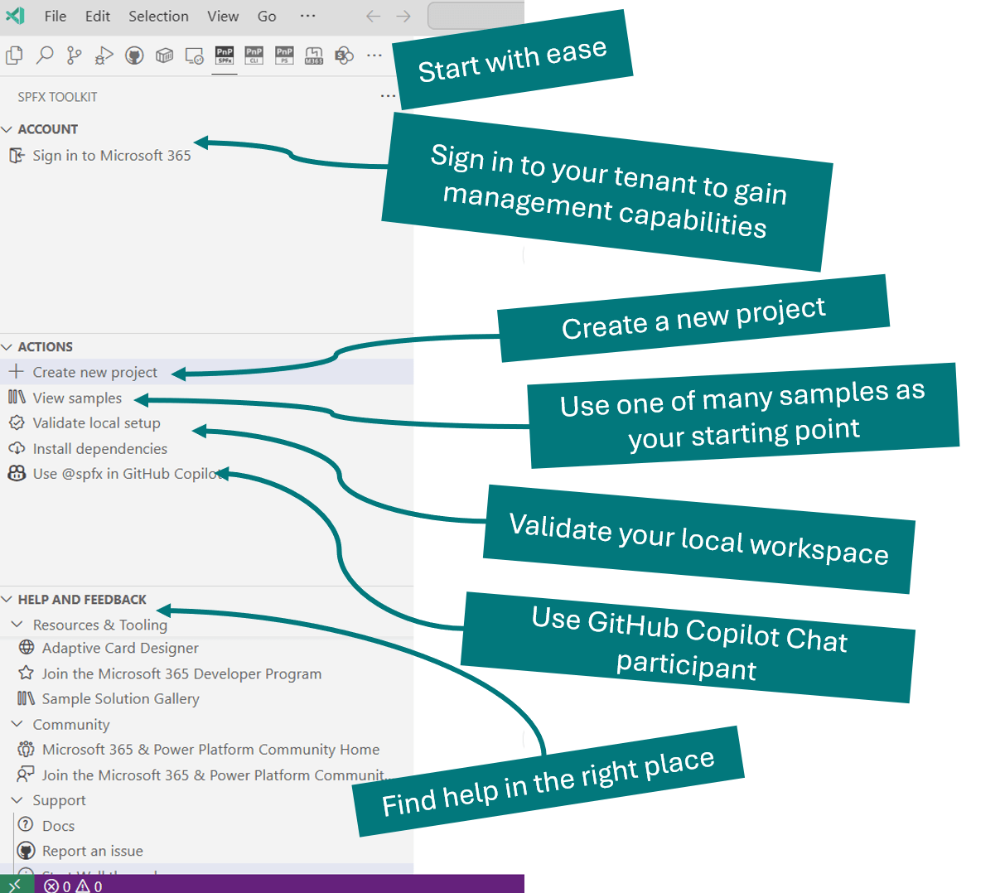
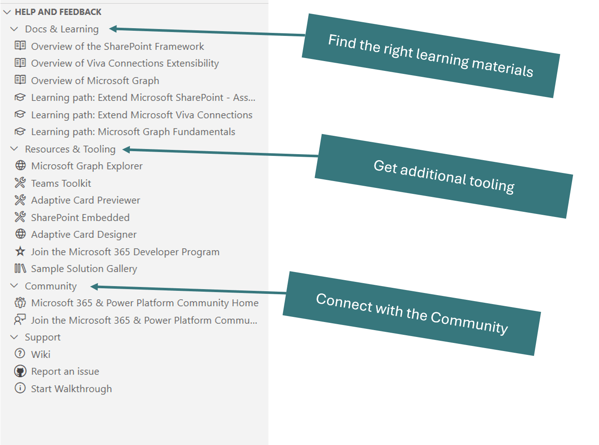

> ### Important: The extension is currently in preview. If you find issues, please report them to the [issue list](https://github.com/pnp/vscode-viva/issues).

 

<h1 align="center">
  
</h1>

# Viva Connections Toolkit for Visual Studio Code

With the Viva Connections Toolkit extension, you can create and manage your Viva Connections solutions in your tenant. All actions you need to perform during the development flow are at your fingertips.

## Architecture

Viva Connections Toolkit for Viva Studio Code is an abstraction layer on top of the [SPFx](https://aka.ms/spfx) Yeoman generator and [CLI for Microsoft 365](https://pnp.github.io/cli-microsoft365/). All operations and actions are performed on the command line level using these two tools with the environment settings on your computer.

This means that the features and capabilities provided through this tool are available for any solution which has been build with SPFx.
 
## Capabilities

The extension provides the following capabilities:

### Welcome experience

The extension automatically detects if you are in a SharePoint Framework project. If not, it will show helpful actions to allow you to create a new Viva Connections app.

### Check the dependencies

To ensure that you can create Viva Connections Toolkit, you can use the **check dependencies** functionality. This action will check if you have the required dependencies to create a new Viva Connections app.

- Node version: 16
- NPM dependencies:
  - gulp
  - yo
  - @microsoft/generator-sharepoint

> **Info**: This list is based on the [set up your development environment recommendations](https://docs.microsoft.com/en-us/sharepoint/dev/spfx/set-up-your-development-environment)

### Installing the dependencies

In case when you do not have all dependencies installed, you can use the **install dependencies** action to install them.

### Start from a sample

From our sample gallery, you can quickly get started with one of the Viva Connections Toolkit that were created by the community.

### Start from a scenario

Start your solution creation based on the provided set of scenarios with ready to use code to showcase what's possible. Scenario solutions are provided with detailed guidance using the [Code Tour](https://aka.ms/codetour) to provide you more details on the structure and options.

### Create a new project

Creating a new project was never easier. Just use the **create a Viva Connections project** action, and the extension will guide you through the process.

### Project actions

When you open a SharePoint Framework solution, you will be able to Sign in and out to your tenant. This allows you to retrieve helpful links to your tenant main SharePoint site and app catalog.

You may also run any gulp task with a click of a button 

As well as perform additional actions that among many things allow you to validate and upgrade your project to the latest version of the SharePoint Framework.

Additionally, you can also add new components to your existing project in a fast and easy way.

### Help and feedback

At any time have easy access to all the up-to-date documentation and additional resources that may be helpful when creating solutions for Viva Connections.

## Contributing

This project welcomes contributions and suggestions. Most contributions require you to agree to a Contributor License Agreement (CLA) declaring that you have the right to grant us the right to use your contribution. For details, visit https://cla.microsoft.com.

When you submit a pull request, a CLA-bot will automatically determine whether you need to provide a CLA and decorate the PR appropriately (e.g., label, comment). Simply follow the instructions provided by the bot. You will only need to do this once across all repos using our CLA.

If you have ideas for new features or feedback, let us know by creating an issue in the [issues list](https://github.com/pnp/vscode-viva/issues). Before you submit a PR with your improvements, please review our [contributing guide](./contributing.md).

## Support

This project is community lead extension provided by the [Microsoft 365 and Power Platform Community](https://aka.ms/m365/community) members. Microsoft employees are closely involved in this work, but the solution is provided under the community brand without direct supportability channels from Microsoft.

## Community

Are you building experiences for the Microsoft 365? - Everyone is welcome to join on our [Microsoft 365 and Power Platform Community](https://aka.ms/m365/community) efforts with community calls, samples and guidance. Join on our [weekly community calls](https://aka.ms/m365/calls) for Microsoft 365 and Power Platform topics. Everyone is welcome 🧡

## Code of Conduct

This project has adopted the [Microsoft Open Source Code of Conduct](https://opensource.microsoft.com/codeofconduct/).
For more information, see the [Code of Conduct FAQ](https://opensource.microsoft.com/codeofconduct/faq/) or contact [opencode@microsoft.com](mailto:opencode@microsoft.com) with any additional questions or comments.

## Changelog

See the [changelog](./CHANGELOG.md) for the latest changes.

## "Sharing is Caring"

<h1 align="center">
  
</h1>

## Additional resources

- Join the [Microsoft 365 Developer Program](https://developer.microsoft.com/en-us/microsoft-365/dev-program) today to get your free Microsoft 365 tenant
- [Microsoft 365 and Power Platform Community](https://pnp.github.io/)

## Disclaimer

**THIS CODE IS PROVIDED *AS IS* WITHOUT WARRANTY OF ANY KIND, EITHER EXPRESS OR IMPLIED, INCLUDING ANY IMPLIED WARRANTIES OF FITNESS FOR A PARTICULAR PURPOSE, MERCHANTABILITY, OR NON-INFRINGEMENT.**
