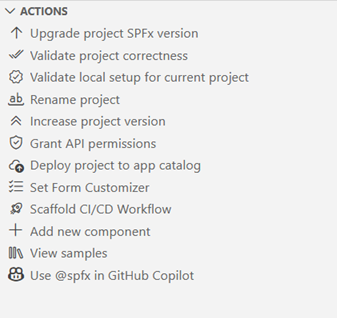
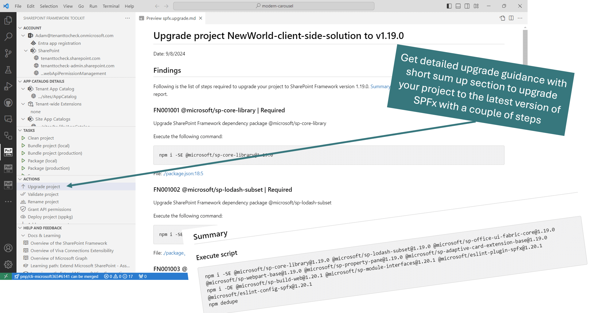
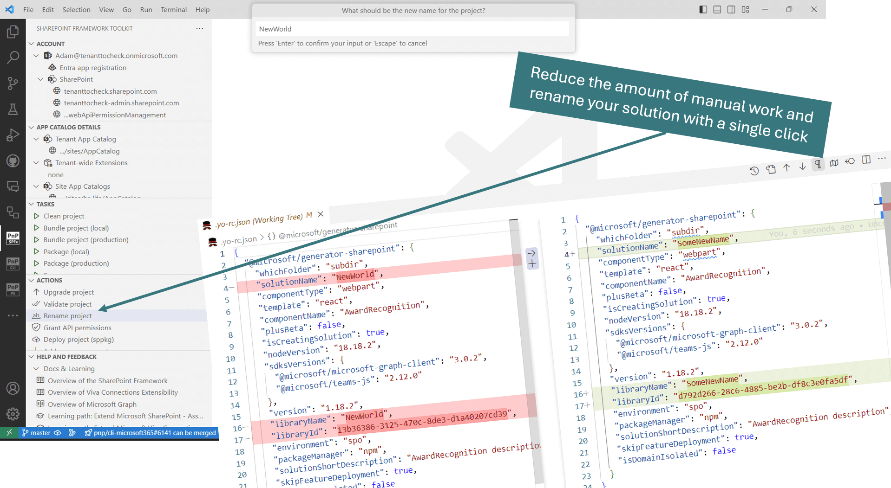
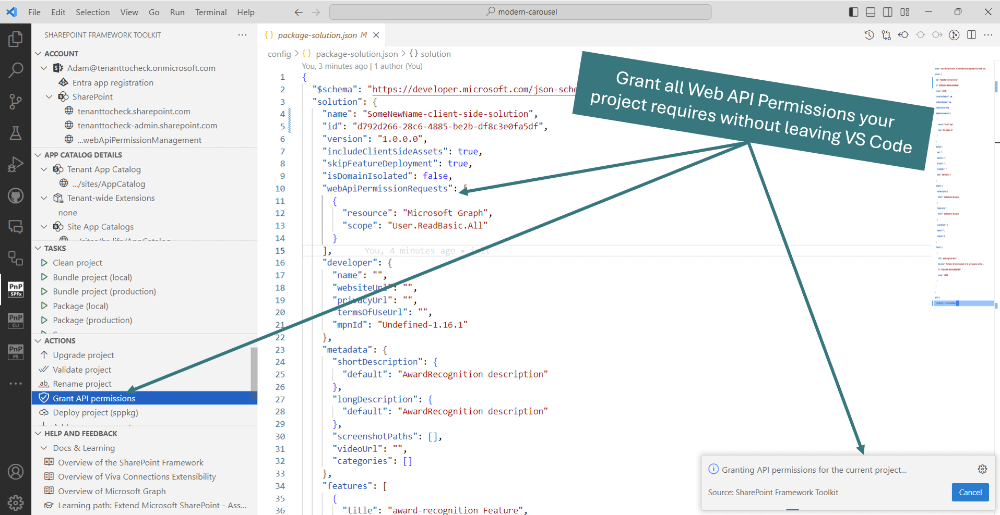
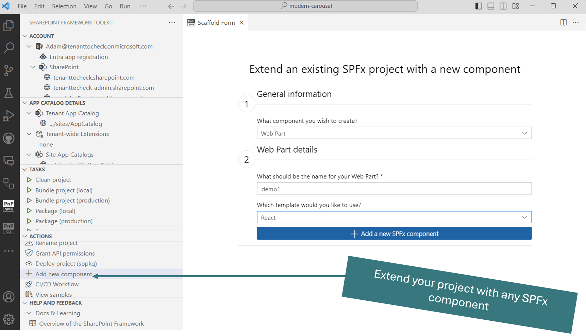
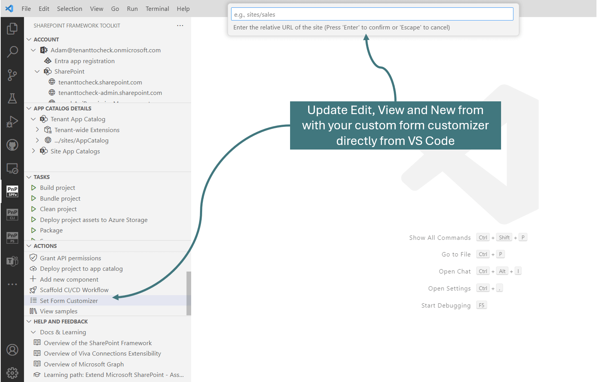

# Actions

The actions section allows unique functionalities that may significantly boost productivity when working with SPFx projects.

Currently the extension allows you to:

- **CI/CD Workflow** - This action will allow you to generate yaml CI/CD GitHub Workflow or Azure DevOps Pipeline to bundle, package, and deploy your project to any app catalog on every code push. 

Check it out in action for GitHub👇

And for Azure DevOps👇

[Check out our docs for more details](https://pnp.github.io/vscode-viva/features/actions/#cicd-workflow)

- **Upgrade project** - Uses CLI for Microsoft 365 to create a .md and/or code tour report with upgrade guidance to the latest supported SPFx version by the extension. The upgrade guidance provides optional as well as required steps a user needs to take manually in order to upgrade the project. At the end of the guidance file, the user may find a summary of the steps in a single script and a couple of manual steps that need to be taken.

And the code tour guidance will provide you upgrade tips directly in your code!

[Check out our docs for more details](https://pnp.github.io/vscode-viva/features/actions/#upgrade-project)

- **Validate project** - Creates a validation .md report and/or code tour validation guidance for the currently open SPFx project. The action will automatically detect the SPFx version used and will validate if the project is properly set up.

[Check out our docs for more details](https://pnp.github.io/vscode-viva/features/actions/#validate-current-project)

- **Rename project** - Forget about manual work and let the extension rename your project and generate a new solution ID. 

[Check out our docs for more details](https://pnp.github.io/vscode-viva/features/actions/#rename-current-project)

- **Grant API permissions** - The action will Grant all API permissions specified in the package-solution.json of the current project. This is especially helpful if you just want to debug your SPFx solution using Workbench. No longer do you need to bundle, package, and deploy the project to then go to the SharePoint admin portal and consent to the permissions. All of that is now done with just a single click. 

[Check out our docs for more details](https://pnp.github.io/vscode-viva/features/actions/#grant-api-permissions)

- **Deploy project** - This action will only work when the user is logged in to tenant and the sppkg file is present. The action will deploy the project to the selected (tenant or site) app catalog. 

[Check out our docs for more details](https://pnp.github.io/vscode-viva/features/actions/#deploy-project)

- **Add new component** - Allows scaffolding a new SPFx project as a new component of the currently opened project. The action under the hood uses the same SharePoint Yeoman generator to scaffold a new project and this feature is an abstraction UI layer. 

[Check out our docs for more details](https://pnp.github.io/vscode-viva/features/actions/#add-new-component)

- **Set Form Customizer** - Allows to update the New, Edit or View from of any SharePoint List to a given SPFx Form Customizer based on provided GUID. 

[Check out our docs for more details](https://pnp.github.io/vscode-viva/features/actions/#set-form-customizer)

- **Increase project version** - This action allows you to increase project major, minor or patch version and automatically align the versioning between `package.json` and `package-solution.json` files.

[Check out our docs for more details](https://pnp.github.io/vscode-viva/features/actions/#increase-project-version)

- **Open sample/scenario galleries of the SPFx web part, extensions, or ACEs projects** - SharePoint Framework Toolkit supports a couple of sample galleries that may be used to scaffold a new SPFx project. 

[Check out our docs for more details](https://pnp.github.io/vscode-viva/features/actions/#open-samplescenario-galleries-of-the-spfx-web-part-extensions-or-aces-projects)