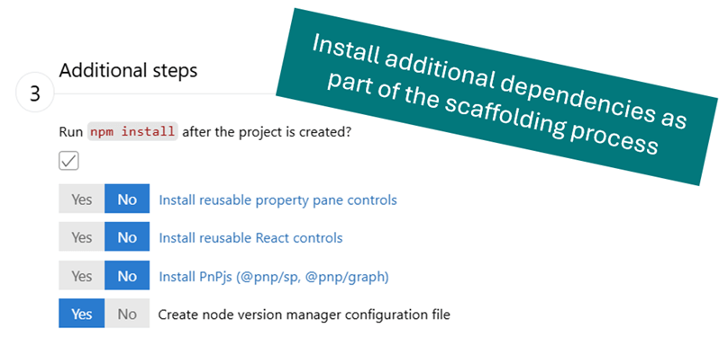
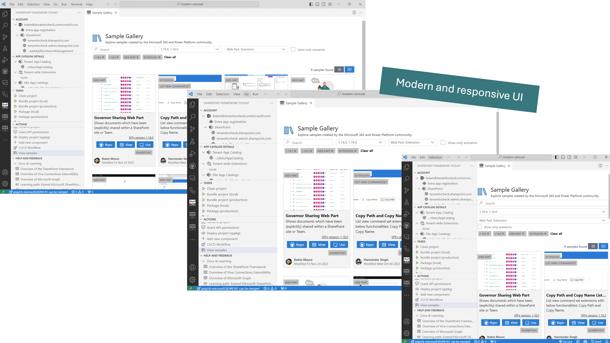

# Create a new project

Creating a new project has never been easier. Just use the **create a new project** action, and the extension will guide you through the process with a dedicated scaffolding form.

It's possible to scaffold any kind of SPFx project including web parts, extensions, library components, and adaptive card extensions.

- **Web parts** are reusable elements that serve as the building blocks for SharePoint pages. They allow you to create customizable controls that can be used across multiple pages.
- **Extensions** enable you to extend the SharePoint user experience by adding scripts to pages, modifying views, adding new actions, and altering list form experiences.
- **Library components** are reusable code elements that can be shared across all the components in the tenant.
- **Adaptive Card Extensions (ACEs)** allow you to build rich, native extensions for Viva Connections Dashboards and SharePoint Pages.

Install additional dependencies with a single click straight from the scaffolding form. Currently we support installing [PnP reusable property pane controls](https://pnp.github.io/sp-dev-fx-property-controls/), [PnP reusable React controls](https://pnp.github.io/sp-dev-fx-controls-react/), [PnPjs](https://pnp.github.io/pnpjs/). Add and preconfigure [SPFx Fast Serve](https://github.com/s-KaiNet/spfx-fast-serve) and add a Node Version Manager configuration file either for NVM or NVS.

[Check out our docs for more details](https://pnp.github.io/vscode-viva/features/scaffolding/#1-scaffold-a-new-spfx-project)

## Don't Start from scratch. Reuse an SPFx (web part or extension) or ACE sample

You may kick-start your development with a new project based on an existing ACE or SPFx web part or extension with a click of a button. All of the provided samples are powered by [PnP Samples repositories](https://pnp.github.io/sp-dev-fx-webparts/samples/type/).

The extension provides a set of filters to help you find the right sample for your needs. You may search by: author, title, description, SPFx version, and component type. It is also possible browse sample details view directly from VS Code checking all sample details before you create a new project.

Switch between the list and grid view and don't worry about the size of your VS Code as it is fully responsive.

Check out how easy it is to create a new project based on an existing sample 👇. 

[Check out our docs for more details](https://pnp.github.io/vscode-viva/features/scaffolding/#2-dont-start-from-scratch---sample-galleries)
