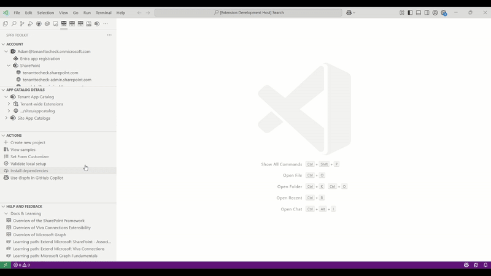
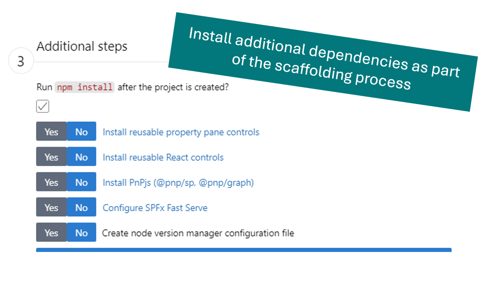
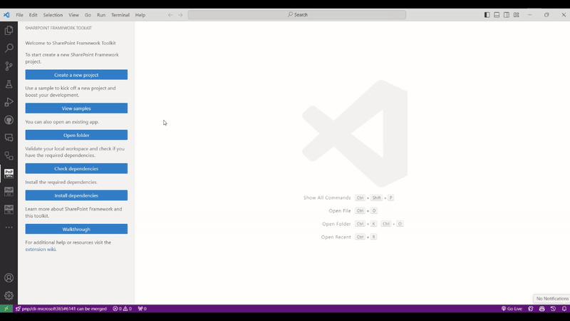

## Create a new project

Creating a new project was never easier. Just use the **create a new project** action, and the extension will guide you through the process with a dedicated scaffolding form.

Check it out in action 👇.

It's possible to scaffold any kind of SPFx project.

Install additional dependencies with a single click straight from the scaffolding form. Currently we support installing [PnP reusable property pane controls](https://pnp.github.io/sp-dev-fx-property-controls/), [PnP reusable React controls](https://pnp.github.io/sp-dev-fx-controls-react/), and [PnPjs](https://pnp.github.io/pnpjs/).

[Check out our docs for more details](https://github.com/pnp/vscode-viva/wiki/5.2-Scaffolding#1-scaffold-a-new-spfx-project)

## Don't Start from scratch. Reuse an SPFx (web part or extension) or ACE sample

You may kick-start your development with a new project based on an existing ACE or SPFx web part or extension with a click of a button. All of the provided samples are powered by [PnP Samples repositories](https://pnp.github.io/sp-dev-fx-webparts/samples/type/).

The extension provides a set of filters to help you find the right sample for your needs. You may search by: author, title, description, SPFx version, and component type. It is also possible browse sample details view directly from VS Code checking all sample details before you create a new project.

Switch between the list and grid view and don't worry about the size of your VS Code as it is fully responsive.

Check out how easy it is to create a new project based on a existing sample 👇. 

[Check out our docs for more details](https://github.com/pnp/vscode-viva/wiki/5.2-Scaffolding#2-dont-start-from-scratch---sample-galleries)
