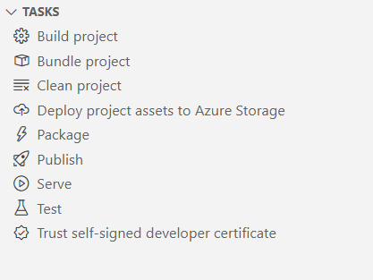

# Tasks

The SharePoint Framework uses [Gulp](https://gulpjs.com/) as its task runner to handle building, bundling, and packaging of the client-side solution project.

The toolchain consists of the following gulp tasks defined in the @microsoft/sp-build-core-tasks package:

- build - Builds the client-side solution project.
- bundle - Bundles the client-side solution project entry point and all its dependencies into a single JavaScript file.
- clean - Cleans the client-side solution project's build artifacts from the previous build and from the build target directories (lib and dist).
- serve - Serves the client-side solution project and assets from the local machine.
- test - Runs unit tests, if available, for the client-side solution project.
- package-solution - Packages the client-side solution into a SharePoint package.
- deploy-azure-storage - Deploys client-side solution project assets to Azure Storage.

SPFx Toolkit VS Code extension shows all possible Gulp tasks one may run on an SPFx project. Don't worry about remembering all the commands, just click on the task you want to run and the extension will do the rest.

The task view will also show all npm scripts that are defined in your package.json file. This way you can easily discover and run any custom scripts you may have defined with a single click.

From version 1.22 onwards, SharePoint Framework uses [Heft](https://heft.rushstack.io/) as the pluggable build system for developing with the SharePoint Framework.

SPFx Toolkit will continue to support Gulp tasks for existing projects, but for new projects created with SPFx 1.22 and above, Heft tasks will be shown in the tasks view alongside npm scripts.

The view allows you to run all Heft tasks that are supported in SPFx projects:

- build - Builds the client-side solution project.
- clean - Cleans the client-side solution project's build artifacts from the previous builds and from the build target directories (lib and dist).
- start - Serves the client-side solution project and assets from the local machine.
- test - Runs unit tests, if available, for the client-side solution project.
- package-solution - Packages the client-side solution into a SharePoint package.
- deploy-azure-storage - Deploys client-side solution project assets to Azure Storage.

and more.

[Check out our docs for more details](https://pnp.github.io/vscode-viva/features/coding)