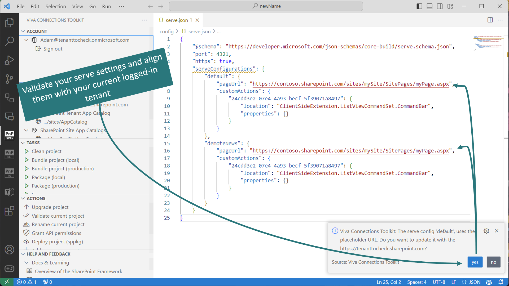

## Login to your tenant & retrieve environment details

The extension allows you to login to your Microsoft 365 tenant using CLI for Microsoft 365.

Thanks to that the extension will retrieve helpful URLs from your tenant like: 

- link to SharePoint main site 
- link to SharePoint admin site
- link to SharePoint web API permission management page

Additionally, the extension will check and retrieve tenant service health incidents that are currently happening in your tenant so that you gain quick insights on your tenant health.

After successful login an additional view is presented that shows list links to app catalogs available in the tenant, both tenant-level and all site-level app catalogs. Additionally it will show you all tenant-wide extensions installed on your tenant with.

Login-in is also required for some actions to work properly like the deploy action which allows you to upload of the .sppkg file to the tenant or site-level App Catalog.

Additionally, when an SPFx project is opened the extension will check serve.json file and suggest updating it to set the properties based on the currently logged-in tenant.

[Check out our docs for more details](https://github.com/pnp/vscode-viva/wiki/5.3-Login-to-your-tenant-&-retrieve-environment-details)