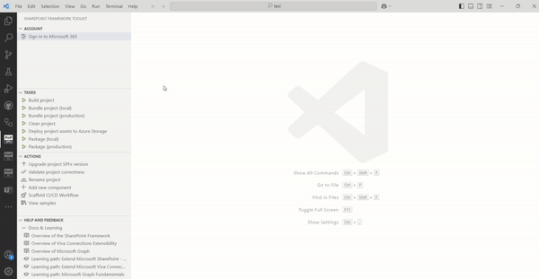
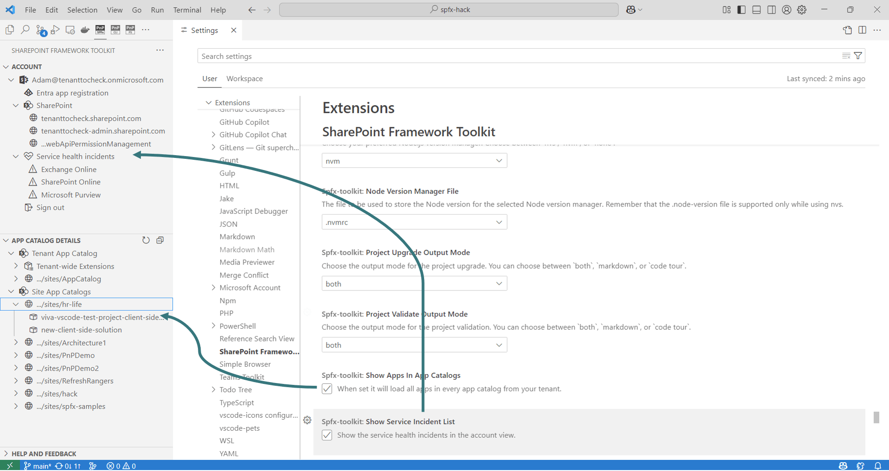

## Sign in to your tenant & retrieve environment details

The extension allows you to sign in to your Microsoft 365 tenant using CLI for Microsoft 365.

SPFx Toolkit needs and Entra App Registration to be able to sign in to your tenant. You may either use an existing app registration or create a new one with a single click using a dedicated form. SPFx Toolkit will guide you through the process of creating a new app registration either manually by providing step-by-step guidance or automatically by creating the app registration for you.

If you already have an Entra App Registration you may use it to sign in to your tenant by providing the Client Id and Tenant Id.

Thanks to that the extension will retrieve helpful URLs from your tenant like link to: 

- SharePoint main site 
- SharePoint admin site
- SharePoint web API permission management page

Additionally, the extension will check and retrieve tenant service health incidents that are currently happening in your tenant so that you gain quick insights on your tenant health.

After successful sign in, an additional view is presented that shows a list of links to app catalogs available in the tenant, both tenant-level and all site-level app catalogs. You can expand each app catalog to reveal the list of apps contained within. Selecting an app navigates you to its details page. Additionally, hovering over an app node presents a set of actions, allowing you to perform various operations directly on the selected app.

- **Deploy**: Makes the solution available for installation in sites but does not automatically install it.
- **Retract**: Reverses the deployment, preventing the solution from being installed in sites.
- **Remove**: Moves the app to the recycle bin, preventing further deployment from the app catalog.
- **Enable**: Allows end users to add the solution to their SharePoint sites.
- **Disable**: Hides the solution from end users, preventing them from adding it to sites.

Additionally, it will show you all tenant-wide extensions installed on your tenant.

Using the extension settings you may choose show or hide the tenant-wide extensions list and tenant health incidents list.

Sign-in is also required for some actions to work properly like the deploy action which allows you to upload of the .sppkg file to the tenant or site-level App Catalog.

[Check out our docs for more details](https://github.com/pnp/vscode-viva/wiki/5.3-Login-to-your-tenant-&-retrieve-environment-details)