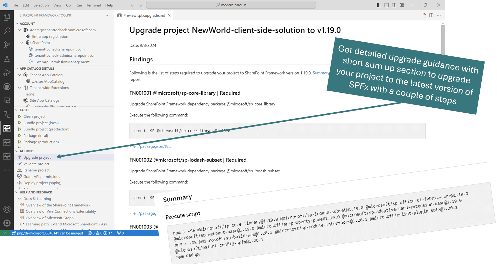
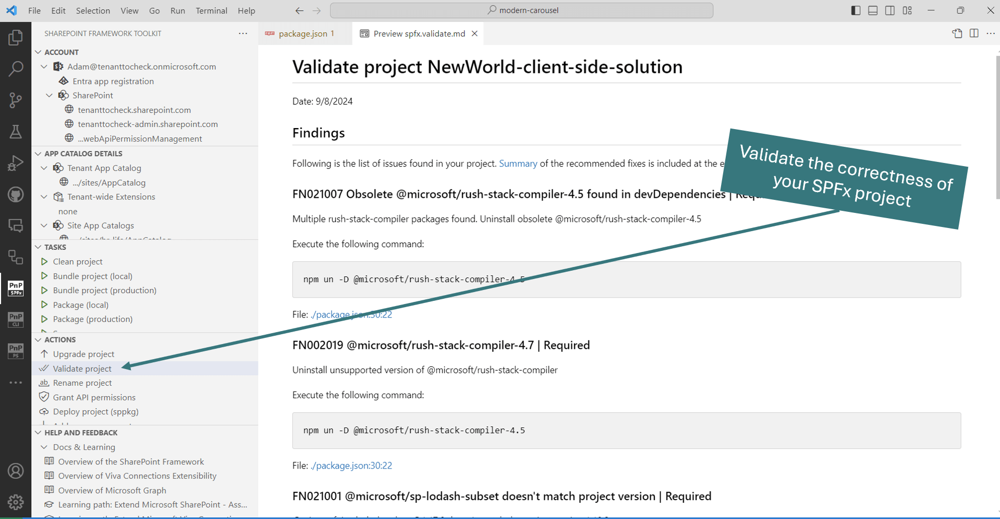

The actions section allows unique functionalities that may significantly boost productivity when working with SPFx projects.

It is possible to:

## Upgrade project

Uses CLI for Microsoft 365 to create a `.md` and/or code tour report with upgrade guidance to the latest supported SPFx version by the extension. The upgrade guidance provides optional as well as required steps a user needs to take manually in order to upgrade the project. At the end of the guidance file, the user may find a summary of the steps in a single script and a couple of manual steps that need to be taken.

And the code tour guidance will provide you upgrade tips directly in your code!

For more information check out the [spfx project upgrade command](https://pnp.github.io/cli-microsoft365/cmd/spfx/project/project-upgrade) in the CLI for Microsoft 365 docs.

## Validate current project

Creates a validation .md report and/or code tour validation guidance for the currently open SPFx project. The action will automatically detect the SPFx version used and will validate if the project is properly set up.

For more information check out the [spfx project doctor](https://pnp.github.io/cli-microsoft365/cmd/spfx/project/project-doctor) in the CLI for Microsoft 365 docs.

## Rename current project

The action will rename your project in the following places: 

- package.json, 
- .yo-rc.json, 
- package-solution.json, 
- deploy-azure-storage.json 
- README.md. 

When specified it will also generate a new solution ID.

For more information check out the [spfx project rename](https://pnp.github.io/cli-microsoft365/cmd/spfx/project/project-rename) in the CLI for Microsoft 365 docs.

## Grant API permissions

The action will Grant all API permissions specified in the package-solution.json of the current project. This is especially helpful if you just want to debug your SPFx solution using Workbench. No longer do you need to bundle, package, and deploy the project to then go to the SharePoint admin portal and consent to the permissions. All of that is now done with just a single click

For more information check out the [spfx project permissions grant](https://pnp.github.io/cli-microsoft365/cmd/spfx/project/project-permissions-grant) in the CLI for Microsoft 365 docs.

## Deploy project 

This action will only work when the user is logged in to the tenant and the sppkg file is present. The action will deploy the project to the selected (tenant or site) app catalog.

For more information check out the [spo app add](https://pnp.github.io/cli-microsoft365/cmd/spo/app/app-add) and [spo app deploy](https://pnp.github.io/cli-microsoft365/cmd/spo/app/app-deploy) in the CLI for Microsoft 365 docs.

## Add new component

Allows scaffolding a new SPFx project as a new component of the currently opened project. The action under the hood uses the same SharePoint Yeoman generator to scaffold a new project and this feature is an abstraction UI layer. The extension will ask for the same information when adding a new component as the SPFx Yeoman generator. After that SharePoint Framework Toolkit will extend the currently opened project with a new component.

## Set Form Customizer

Allows to update the New, Edit or View form of any SharePoint List to a given SPFx Form Customizer based on provided GUID.

## Increase project version

This action allows you to increase project major, minor or patch version and automatically align the versioning between `package.json` and `package-solution.json` files. If the SPFx solution is part of a Teams Toolkit project it will also update the versioning the `package.json` of the Teams Toolkit project.

## Open sample/scenario galleries of the SPFx web part, extensions, or ACEs projects

SharePoint Framework Toolkit supports a couple of sample galleries that may be used to scaffold a new SPFx project. You may use the sample gallery to kick off a new solution or for inspiration for your current one.
