This action will allow you to generate yaml GitHub workflow or Azure DevOps pipeline to bundle, package, and deploy your project to any app catalog on every code push or on the manual run
 


SharePoint Framework Toolkit extends VS Code with additional UI to present you with a scaffolding form that will allow you to create a CI/CD Workflow in 3 easy steps. 

It's important to know that many fields are already prefilled and it is possible to hit create without changing any value to get a basic and default YAML workflow file.

## GitHub

```
name: Deploy Solution test-solution
on:
  push:
    branches:
      - main
  workflow_dispatch: null
jobs:
  build-and-deploy:
    runs-on: ubuntu-latest
    steps:
      - name: Checkout
        uses: actions/checkout@v3.5.3
      - name: Use Node.js 16.x
        uses: actions/setup-node@v3.7.0
        with:
          node-version: 16.x
      - name: Run npm ci
        run: npm ci
      - name: Bundle & Package
        run: |
          gulp bundle --ship
          gulp package-solution --ship
      - name: CLI for Microsoft 365 Login
        uses: pnp/action-cli-login@v2.2.2
        with:
          CERTIFICATE_ENCODED: ${{ secrets.CERTIFICATE_ENCODED }}
          CERTIFICATE_PASSWORD: ${{ secrets.CERTIFICATE_PASSWORD }}
          TENANT: ${{ secrets.TENANT_ID }}
      - name: CLI for Microsoft 365 Deploy App
        uses: pnp/action-cli-deploy@v3.0.1
        with:
          APP_FILE_PATH: sharepoint/solution/test-solution.sppkg
          SKIP_FEATURE_DEPLOYMENT: true
          OVERWRITE: true

```
Scaffolding form

**1 step**

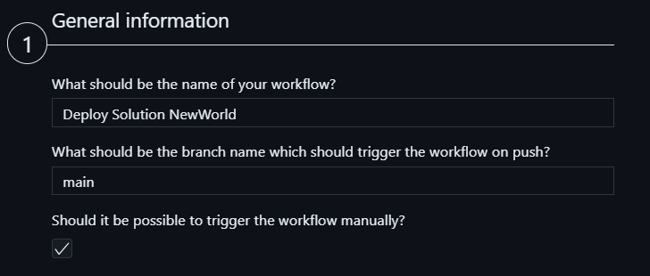

In the first section of the form you may provide general information about your workflow like what will be its name, or what is the name of the branch that every push will trigger the flow to run. It is also possible to allow you to run the workflow manually using the GitHub UI

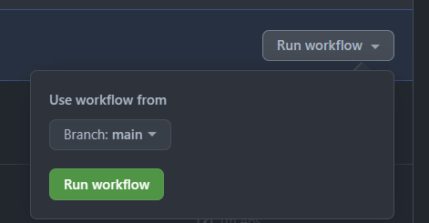

**2 step**

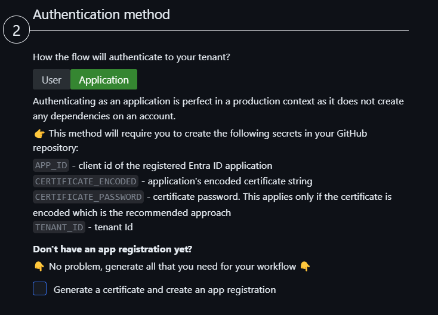

In the second step, you will need to decide how your flow will authenticate to your tenant. It is possible to pick between the user and application login method

for `application`, the following yaml will be generated for this step (this is the default option).
```
- name: CLI for Microsoft 365 Login
        uses: pnp/action-cli-login@v2.2.2
        with:
          CERTIFICATE_ENCODED: ${{ secrets.CERTIFICATE_ENCODED }}
          CERTIFICATE_PASSWORD: ${{ secrets.CERTIFICATE_PASSWORD }}
          APP_ID: ${{ secrets.APP_ID }}
          TENANT: ${{ secrets.TENANT_ID }}
```

It is also possible to generate a certificate and create a new Entra ID app registration directly within the form for your workflow. Simply check the additional checkbox and provide a password for your certificate and the name for your new app registration. Submitting the form will also create the file and the app and at the end, it will give you the generated values so that you may copy them to the secrets that are required to be created in GitHub repo for this authentication method.

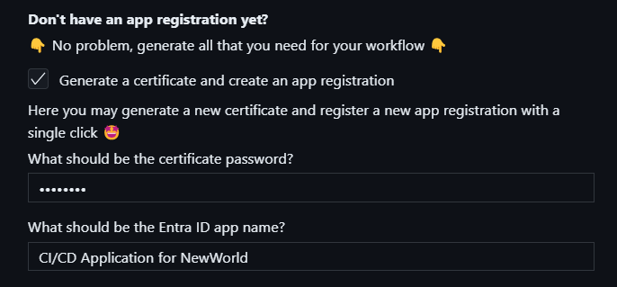

for `user`, the following yaml will be generated for this step
```
- name: CLI for Microsoft 365 Login
        uses: pnp/action-cli-login@v2.2.2
        with:
          ADMIN_USERNAME: ${{ secrets.ADMIN_USERNAME }}
          ADMIN_PASSWORD: ${{ secrets.ADMIN_PASSWORD }}
```

**3 step**

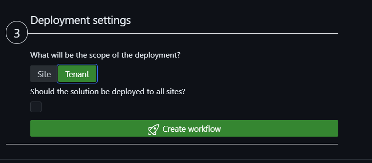

Here we may specify if we will deploy the app to tenant or site-level app catalog. When the site type is selected then an additional select field will be presented to specify the site app catalog url. For the site type the following yaml will be added to the last step

```
SCOPE: sitecollection
SITE_COLLECTION_URL: https://sharepoint.tenant.com/appcatalog
```

***

This action only generates the workflow yaml file. It does not do any additional setting on GitHub. Depending on which login method you select additional steps are needed.

Depending on which authentication method was selected in GitHub repo settings, you will need to create the following secrets:

For the `application` login method you will need to create the following secrets in GitHub repo settings:

- `APP_ID` - client id of the registered AAD application
- `CERTIFICATE_ENCODED` - application's encoded certificate
- `CERTIFICATE_PASSWORD` - certificate password. This applies only if the certificate is encoded which is the recommended approach
- `TENANT` - Tenant ID

This use case is perfect in a production context as it does not create any dependencies on an account.

For the `user` login method you will need to create the following secrets in GitHub repo settings:

- `ADMIN_USERNAME` - username
- `ADMIN_PASSWORD` - password

This use case is perfect for testing. It will not work if the specified account uses MFA.

Check it out in action 👇


For more information check out the [spfx project github workflow add](https://pnp.github.io/cli-microsoft365/cmd/spfx/project/project-github-workflow-add) and how to [automate your CI/CD workflow using CLI for Microsoft 365 GitHub Actions](https://pnp.github.io/cli-microsoft365/user-guide/github-actions) in the CLI for Microsoft 365 docs.

## Azure DevOps
```
name: Deploy Solution demo-1
trigger:
  branches:
    include:
      - main
pool:
  vmImage: ubuntu-latest
variables:
  - name: CertificateBase64Encoded
    value: ""
  - name: CertificateSecureFileId
    value: ""
  - name: CertificatePassword
    value: ""
  - name: EntraAppId
    value: ""
  - name: TenantId
    value: ""
  - name: SharePointBaseUrl
    value: ""
  - name: PackageName
    value: demo-1.sppkg
  - name: SiteAppCatalogUrl
    value: https://tenanttocheck.sharepoint.com/sites/CLIDemo1/AppCatalog
stages:
  - stage: Build_and_Deploy
    jobs:
      - job: Build_and_Deploy
        steps:
          - task: NodeTool@0
            displayName: Use Node.js
            inputs:
              versionSpec: 18.x
          - task: Npm@1
            displayName: Run npm install
            inputs:
              command: install
          - task: Gulp@0
            displayName: Gulp bundle
            inputs:
              gulpFile: ./gulpfile.js
              targets: bundle
              arguments: --ship
          - task: Gulp@0
            displayName: Gulp package
            inputs:
              targets: package-solution
              arguments: --ship
          - task: Npm@1
            displayName: Install CLI for Microsoft 365
            inputs:
              command: custom
              verbose: false
              customCommand: install -g @pnp/cli-microsoft365
          - script: >
              
              m365 login --authType certificate --certificateBase64Encoded '$(CertificateBase64Encoded)' --password '$(CertificatePassword)' --appId '$(EntraAppId)' --tenant '$(TenantId)' 

              m365 spo set --url '$(SharePointBaseUrl)' 

              m365 spo app add --filePath '$(Build.SourcesDirectory)/sharepoint/solution/$(PackageName)' --appCatalogScope sitecollection --appCatalogUrl '$(SiteAppCatalogUrl)' --overwrite 

              m365 spo app deploy --skipFeatureDeployment --name '$(PackageName)' --appCatalogScope sitecollection --appCatalogUrl '$(SiteAppCatalogUrl)'
            displayName: CLI for Microsoft 365 Deploy App

```

Scaffolding form

**1 step**

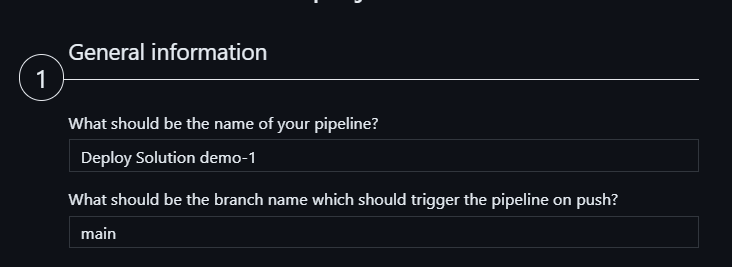

Here we need to specify what will be the name of the pipeline and what will be the branch name that will trigger the pipeline on every code push.

**2 step**

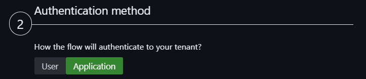

Here we need to decide what will be authentication method the pipeline will use to login to your tenant and deploy the app. Based on the selected method you will get different variables and different script used in the YAML pipeline file.

User login method is perfect for testing but is not the best fit for a pipeline that is supposed to be used in production. It also does not support multifactor authentication

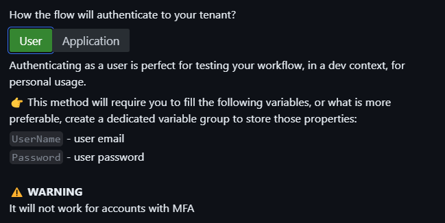

Application login is perfect for a production pipeline. In this case, your pipeline will be created with a set of variables that are required to define the Entra application that will be used. Although you may populate those variables in the pipeline itself it is more recommended to create a dedicated variable group in Azure DevOps Library page and use it in your pipeline 

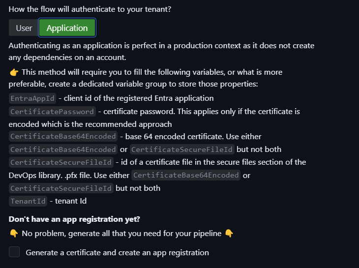

It is also possible to generate a certificate and create a new Entra ID app registration directly within the form for your workflow. Simply check the additional checkbox and provide a password for your certificate and the name for your new app registration. Submitting the form will also create the file and the app and at the end, it will give you the generated values so that you may copy them to populate either the correct variables in your pipeline or in the dedicated variable group in Azure DevOps

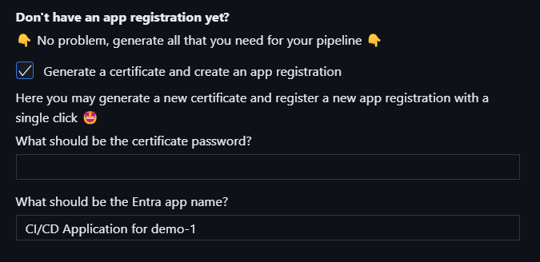

**3 step**

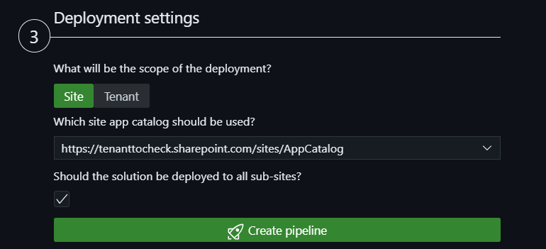

Here we may specify if we will deploy the app to tenant or site-level app catalog. When the site type is selected then an additional select field will be presented to specify the site app catalog url. For the site type the following yaml will be added to the last step

***

This action only generates the workflow yaml file. It does not do any additional setting on Azure DevOps. After you generate the pipeline file you will need to commit and push it to Azure DevOps repo and next create a pipeline build based on this file. To do that please follow the guidance you will get after the flow is generated

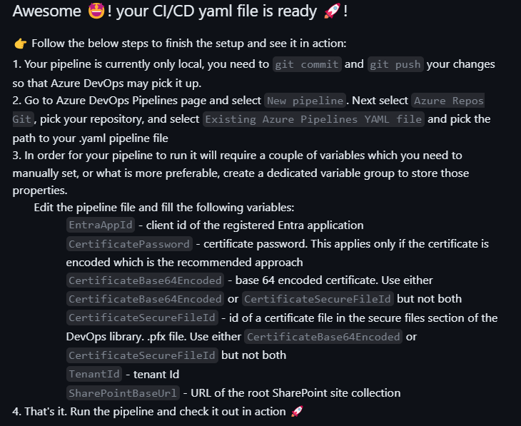

Creating a new pipeline in Azure DevOps is a one-time operation and then every time you update the YAML definition Azure DevOps will automatically pick up the changes.
In order to create a new pipeline go pipelines page in your Azure DevOps project

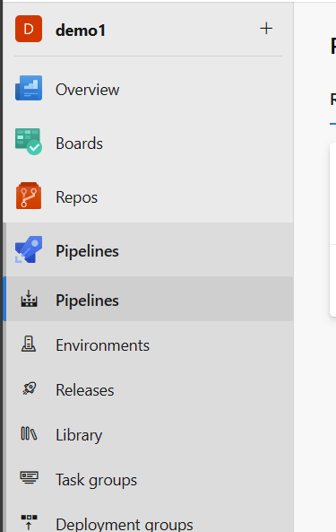

Then select the `New pipeline` button in the top right corner of the page. This will open a new page where you may select the location of your repo. Select `Azure Repos Git` and then select the repo where you pushed the YAML file.

Next in the top right corner of the page hit on the `New pipline` button. After that follow the for by selecting the location of your repo, next the branch on which the YAML file is present and then select the option to create a new pipeline based on `Existing Azure Pipelines YAML file`

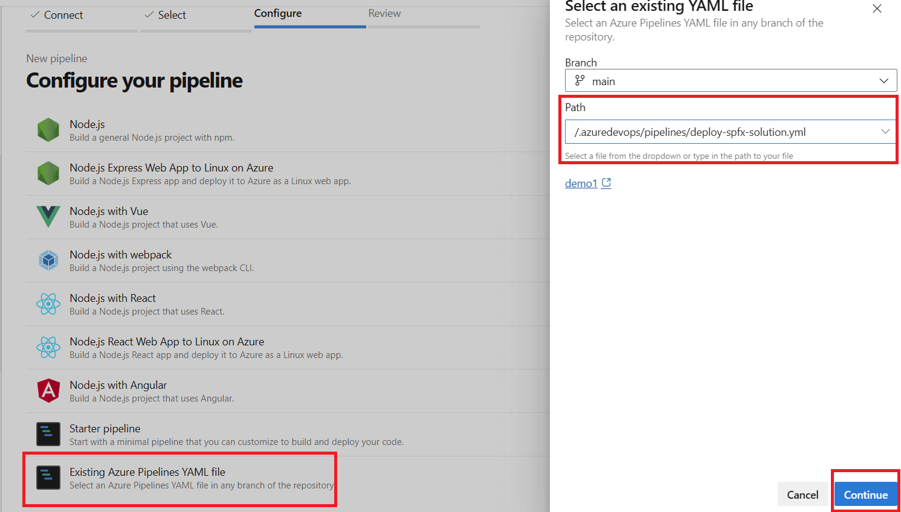

After that just confirm the create process and your ready to go!

Check it out in action 👇

