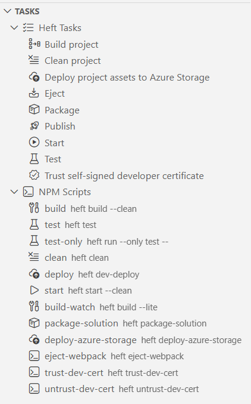

SPFx Toolkit comes with a set of features that will speed up your development process. It includes tasks view with all of the available Gulp tasks with also some new ones added by this extension that are a combination of existing tasks, and npm scripts that are present in your package.json file. The extension also comes with a set of code snippets that will help you to quickly scaffold new code in your SPFx project.

## Tasks view

### Heft

For newer versions of SPFx (1.22 and above), Heft is used as the pluggable build system for developing with the SharePoint Framework.

SPFx Toolkit will show all Heft tasks that are supported in SPFx projects and will allow you to run them even if you do not have Heft installed globally.

Additionally, the view will show all npm scripts that are present in your package.json file to help you easily discover and run any custom scripts you may have defined.

Here is a brief explanation of the available Heft tasks that are included in this view:

- **Build project**: Compiles the SPFx project.
- **Clean project**: Removes temporary files and build artifacts.
- **Deploy project assets to Azure Storage**: Uploads project assets to Azure Storage.
- **Eject**: Ejects the project from Heft, allowing for custom build configurations.
- **Package**: Packages the project into a deployable solution.
- **Publish**: Builds and Packages the project for deployment.
- **Start**: Starts a local development server to preview the project.
- **Test**: Runs the project's test cases.
- **Trust self-signed developer certificate**: Trusts the self-signed certificate required for local development.

### Gulp

For SPFx projects created with versions below 1.22, Gulp is used as the task runner to handle building, bundling, and packaging of the client-side solution project.

In this case, SPFx Toolkit will also show all npm scripts that are present in your package.json file to help you easily discover and run any custom scripts you may have defined.

Here is a brief explanation of the available Gulp tasks that are included in this view:

- **Build project**: Compiles the SPFx project.
- **Bundle project**: Bundles the project files for deployment.
- **Clean project**: Removes temporary files and build artifacts.
- **Deploy project assets to Azure Storage**: Uploads project assets to Azure Storage.
- **Package**: Packages the project into a deployable solution.
- **Publish**: Bundles and packages the project for deployment.
- **Serve**: Starts a local development server to preview the project.
- **Test**: Runs the project's test cases.
- **Trust self-signed developer certificate**: Trusts the self-signed certificate required for local development.

## Coding Snippets 

The SharePoint Framework Toolkit comes together as a bundle with two other extensions. One of them is [SPFx Snippets](https://marketplace.visualstudio.com/items?itemName=eliostruyf.spfx-snippets) created by [Elio Struyf](https://www.eliostruyf.com/). 

It contains snippets for working in:

- JavaScript (resource files)
- React
- SASS (SCSS)
- TypeScript
- JSON

In order to start using it simply start typing from `spfx-` and you should see a full list of snippets that will inject code into the current file.

Check out the extension [details to learn more](https://github.com/estruyf/vscode-spfx-snippets#usage) 

Check it out in action 👇

