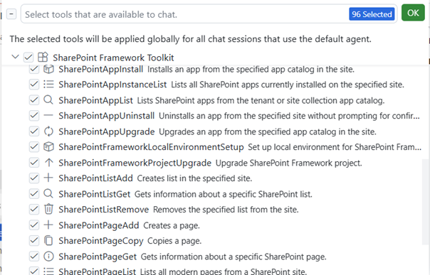
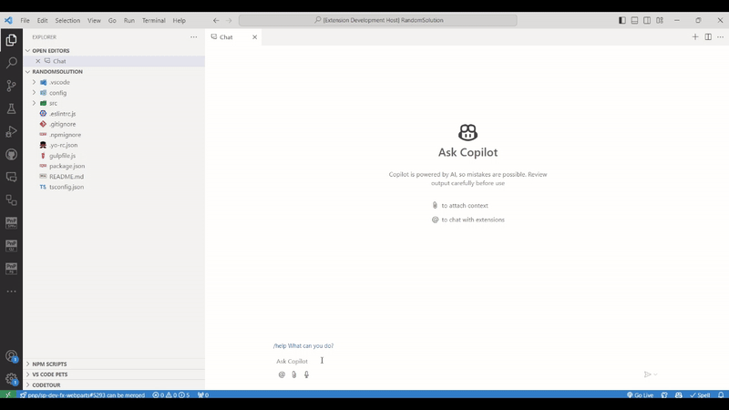

SPFx Toolkit provides a set of AI capabilities that may be used in GitHub Copilot Chat extension. The chat participant allows you to have a discussion grounded for SharePoint Framework development and the Language Model tools will provide you with several capabilities to manage your SharePoint Online tenant.

## Agent Mode - Language Model Tools

SPFx Toolkit provides a set of language model tools that are available in GitHub Copilot agent mode. Some of them are designed to work in the context of your SharePoint Framework project but other may work regardless of what you have opened in VS Code and aim to do common task on your SharePoint Online tenant.

You don't need to do anything specific to use any of the language model tools in GitHub Copilot agent mode. Copilot should figure out the best tool that it may use to fulfill your prompt. Optionally you may `#` hashtag a tool in your prompt to make it clear what you want to be used.

### SharePoint Online Management

This set of tools aim to allow you to perform common management tasks on your SharePoint Online tenant. In order to use them you need to be first signed in to your tenant in SPFx Toolkit. 

The extension provides the following tools

| Tool                              | Description                                                 |
|-----------------------------------|-------------------------------------------------------------|
| SharePointAppInstall              | Installs an app from tenant app catalog in the site         |
| SharePointAppInstanceList         | Lists app instances installed in the specified site         |
| SharePointAppList                 | Lists apps from the tenant app catalog                      |
| SharePointAppUninstall            | Uninstalls an app from the specified site                   |
| SharePointAppUpgrade              | Upgrades an app to the latest version in the specified site |
| SharePointFrameworkProjectUpgrade | Upgrade SharePoint Framework project                        |
| SharePointListAdd                 | Creates list in the specified site                          |
| SharePointListGet                 | Gets information about the specific list                    |
| SharePointListRemove              | Removes the specified list                                  |
| SharePointPageAdd                 | Creates a page                                              |
| SharePointPageGet                 | Gets information about the specific page                    |
| SharePointPageList                | Lists all pages in the specified site                       |
| SharePointPageCopy                | Copies a page from a source site to a target site           |
| SharePointPageRemove              | Removes the specified page                                  |
| SharePointSiteAdd                 | Create a new SharePoint Online site                         |
| SharePointSiteGet                 | Gets information about the specific site                    |
| SharePointSiteRemove              | Remove a SharePoint Online site                             |

## Chat Participant

SPFx Toolkit comes along with a chat participant that you may use in GitHub Copilot ask mode. Simply, mention @spfx in the chat to ask dedicated questions regarding SharePoint Framework development. 

@spfx is your dedicated AI assistant that will help you with anything that is needed to develop your SharePoint Framework project. It has predefined commands that are tailored toward a specific activity for which you require guidance.

Lets explore the available commands that you may use in the chat participant.

### `/new`

May be used to get guidance on how to create a new solution or find and reuse an existing sample from the PnP SPFx sample gallery
Check it out in action 👇

### `/info (Deprecated)`

The `/info` command has been deprecated. For tenant data retrieval, list and file discovery, metadata queries, schema extraction, and read-only introspection capabilities, please use the **[CLI for Microsoft 365 MCP server](https://pnp.github.io/cli-microsoft365/user-guide/using-cli-mcp-server/)** directly. It is now the main supported way to access and inspect SharePoint Online tenant data.