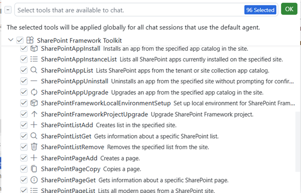
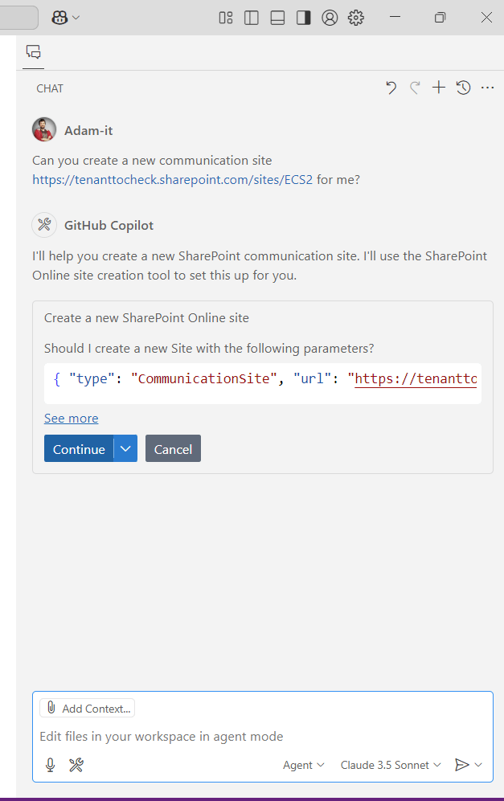

SPFx Toolkit provides a set of AI Language Model tools that  will provide you with several capabilities to manage your SharePoint Online tenant.

## Language Model Tools

SPFx Toolkit provides a set of language model tools that are available in GitHub Copilot agent mode. Some of them are designed to work in the context of your SharePoint Framework project but other may work regardless of what you have opened in VS Code and aim to do common task on your SharePoint Online tenant.

You don't need to do anything specific to use any of the language model tools in GitHub Copilot agent mode. Copilot should figure out the best tool that it may use to fulfill your prompt. Optionally you may `#` hashtag a tool in your prompt to make it clear what you want to be used.

This set of tools aim to allow you to perform common management tasks on your SharePoint Online tenant. In order to use them you need to be first signed in to your tenant in SPFx Toolkit. 

The extension provides the following tools

| Tool                              | Description                                               |
|-----------------------------------|-----------------------------------------------------------|
| SharePointAppInstall              | Installs an app from tenant app catalog in the site       |
| SharePointAppInstanceList         | List installed SharePoint apps in a site                  |
| SharePointAppList                 | Lists apps from the tenant app catalog                    |
| SharePointAppUninstall            | Uninstalls an app from a site                             |
| SharePointAppUpgrade              | Upgrade a SharePoint app in the specified site            |
| SharePointListAdd                 | Creates list in the specified site                        |
| SharePointListGet                 | Gets information about the specific list                  |
| SharePointListRemove              | Removes the specified list                                |
| SharePointPageAdd                 | Creates a page                                            |
| SharePointPageGet                 | Gets information about the specific page                  |
| SharePointPageList                | Lists pages in the specified site                         |
| SharePointPageCopy                | Copies a SharePoint page                                  |
| SharePointPageRemove              | Removes the specified page                                |
| SharePointSiteAdd                 | Create a new SharePoint Online site                       |
| SharePointSiteGet                 | Gets information about the specific site                  |
| SharePointSiteRemove              | Remove a SharePoint Online site                           |
| SharePointFrameworkProjectUpgrade | Upgrade SharePoint Framework project                      |
| SharePointFrameworkLocalEnvironmentSetup | Set up local environment for SharePoint Framework development |
| SharePointFrameworkCreateNewProject | Create a new SharePoint Framework project               |

## Managing Microsoft 365 tenant using natural language

SPFx Toolkit no longer supports retrieving data from your SharePoint Online tenant by using the  `/info` chat participant command. In order to manage your Microsoft 365 tenant using natural language, we recommend using the **[CLI for Microsoft 365 MCP server](https://pnp.github.io/cli-microsoft365/user-guide/using-cli-mcp-server/)**.