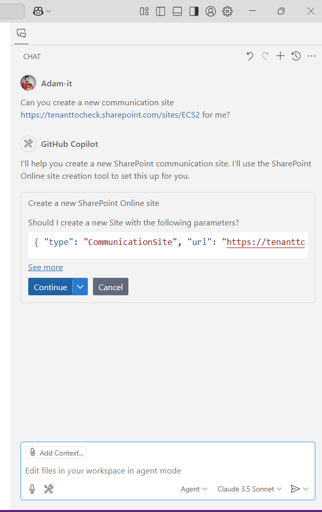
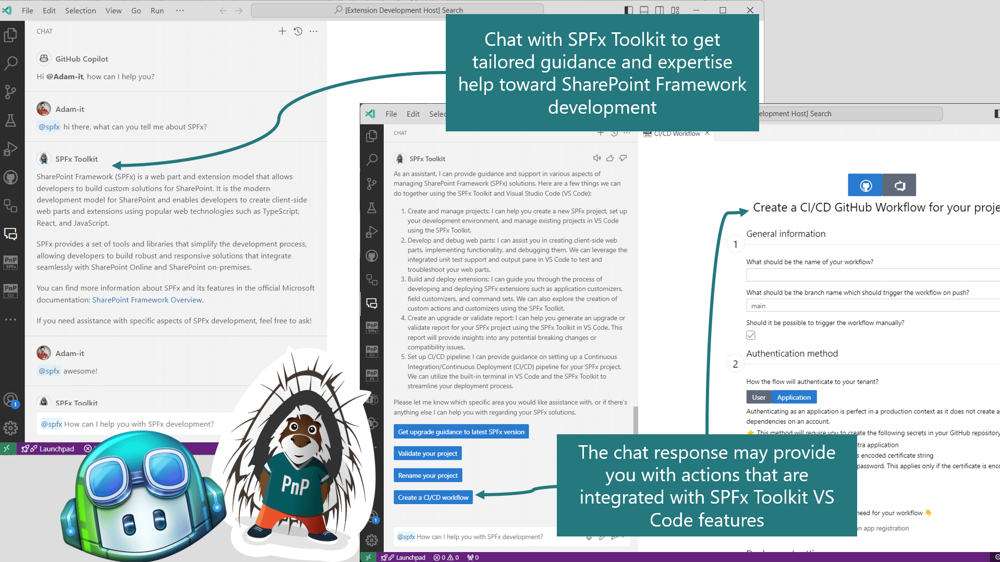

SPFx Toolkit provides a set of AI capabilities that may be used in GitHub Copilot Chat extension. The chat participant allows you to have a discussion grounded for SharePoint Framework development and the Language Model tools will provide you with several capabilities to manage your SharePoint Online tenant.

## Agent Mode - Language Model Tools

SPFx Toolkit provides a set of language model tools that are available in GitHub Copilot agent mode. Some of them are designed to work in the context of your SharePoint Framework project but other may work regardless of what you have opened in VS Code and aim to do common task on your SharePoint Online tenant.

You don't need to do anything specific to use any of the language model tools in GitHub Copilot agent mode. Copilot should figure out the best tool that it may use to fulfill your prompt. Optionally you may `#` hashtag a tool in your prompt to make it clear what you want to be used.

### SharePoint Online Management

This set of tools aim to allow you to perform common management tasks on your SharePoint Online tenant. In order to use them you need to be first signed in to your tenant in SPFx Toolkit. 

The extension provides the following tools

| Tool                 | Description                                               |
|----------------------|-----------------------------------------------------------|
| SharePointAppList    | Lists apps from the tenant app catalog                    |
| SharePointAppInstall | Installs an app from tenant app catalog in the site       |
| SharePointListAdd    | Creates list in the specified site                        |
| SharePointListGet    | Gets information about the specific list                  |
| SharePointListRemove | Removes the specified list                                |
| SharePointPageAdd    | Creates a page                                            |
| SharePointSiteAdd    | Create a new SharePoint Online site                       |
| SharePointSiteRemove | Remove a SharePoint Online site                           |
| SharePointSiteGet    | Gets information about the specific site                  |

## Chat Participant

SPFx Toolkit comes along with a chat participant that you may use in GitHub Copilot ask mode. Simply, mention @spfx in the chat to ask dedicated questions regarding SharePoint Framework development. 

@spfx is your dedicated AI assistant that will help you with anything that is needed to develop your SharePoint Framework project. It has predefined commands that are tailored toward a specific activity for which you require guidance.

Lets explore the available commands that you may use in the chat participant.

### `/setup` 

Dedicated to providing information on how to setup your local workspace for SharePoint Framework development. 
Check it out in action 👇

### `/new`

May be used to get guidance on how to create a new solution or find and reuse an existing sample from the PnP SPFx sample gallery
Check it out in action 👇

### `/info` 

This command will allow you to ask and retrieve any kind of data from your SharePoint Online tenant. This command will only work if you are signed in to your tenant. It uses CLI for Microsoft 365 commands under the hood to retrieve and explain data from your SharePoint Online tenant. Currently, it does support only retrieving information, it will not support you in creating, updating or removing any resources for this you should be using Language Model tools in agent mode. 

For example, you may check if some list item or file exists. Or how many items with specific metadata do you have on a list? Or ask for content type columns to generate an interface based on the response quickly.

<video width="100%" controls>
  <source src="https://github.com/user-attachments/assets/be808a6f-6533-4e36-bb46-019682e41158" type="video/mp4" />
  Your browser does not support the video tag.  
  <a href="https://github.com/user-attachments/assets/be808a6f-6533-4e36-bb46-019682e41158" target="_blank" rel="noopener noreferrer">
    Click here to download and view the video.
  </a>
</video>

This command understands and uses the following CLI for Microsoft 365 commands:

| Command                        | Description                                           |
|--------------------------------|-------------------------------------------------------|
| m365 spo page template list    | Lists all page templates in the given site            |
| m365 spo homesite get          | Gets information about the Home Site                  |
| m365 spo theme list            | Retrieves the list of custom themes                   |
| m365 spo file sharinginfo get  | Generates a sharing information report for the specified file |
| m365 spo get                   | Gets the context URL for the root SharePoint site collection and SharePoint tenant admin site |
| m365 spo sitedesign run status get | Gets information about the site scripts executed for the specified site design |
| m365 spo app instance list     | Retrieve apps installed in a site                     |
| m365 spo page control get      | Gets information about the specific control on a modern page |
| m365 spo page get              | Gets information about the specific modern page       |
| m365 spo web list              | Lists subsites of the specified site                  |
| m365 spo listitem get          | Gets a list item from the specified list              |
| m365 spo app list              | Lists apps from the specified app catalog             |
| m365 spo contenttype get       | Retrieves information about the specified list or site content type |
| m365 spo storageentity list    | Lists tenant properties stored on the specified SharePoint Online app catalog |
| m365 spo site get              | Gets information about the specific site collection   |
| m365 spo web installedlanguage list | Lists all installed languages on site                |
| m365 spo field list            | Retrieves columns for the specified list or site      |
| m365 spo list sitescript get   | Extracts a site script from a SharePoint list         |
| m365 spo tenant commandset get | Get a ListView Command Set that is installed tenant wide |
| m365 spo site list             | Lists modern sites of the given type                  |
| m365 spo storageentity get     | Get details for the specified tenant property         |
| m365 spo cdn policy list       | Lists CDN policies settings for the current SharePoint Online tenant |
| m365 spo web get               | Retrieve information about the specified site         |
| m365 spo sitedesign list       | Lists available site designs for creating modern sites |
| m365 spo term list             | Lists taxonomy terms from the given term set          |
| m365 spo term group get        | Gets information about the specified taxonomy term group |
| m365 spo eventreceiver get     | Retrieves specific event receiver for the specified web, site or list by event receiver name or id |
| m365 spo tenant commandset list | Retrieves a list of ListView Command Sets that are installed tenant-wide |
| m365 spo user get              | Gets a site user within specific web                  |
| m365 spo customaction list     | Lists user custom actions for site or site collection |
| m365 spo tenant settings list  | Lists the global tenant settings                      |
| m365 spo roledefinition get    | Gets specified role definition from web               |
| m365 spo field get             | Retrieves information about the specified list- or site column |
| m365 spo list list             | Gets all lists within the specified site              |
| m365 spo applicationcustomizer list | Get a list of application customizers that are added to a site |
| m365 spo term group list       | Lists taxonomy term groups                            |
| m365 spo site apppermission get | Get a specific application permissions for the site   |
| m365 spo web clientsidewebpart list | Lists available client-side web parts               |
| m365 spo user list             | Lists all the users within specific web               |
| m365 spo group list            | Lists all the groups within specific web              |
| m365 spo orgassetslibrary list | List all libraries that are assigned as asset library |
| m365 spo sitedesign task list  | Lists site designs scheduled for execution on the specified site |
| m365 spo file sharinglink get  | Gets details about a specific sharing link of a file  |
| m365 spo contenttypehub get    | Returns the URL of the SharePoint Content Type Hub of the Tenant |
| m365 spo serviceprincipal permissionrequest list | Lists pending permission requests                |
| m365 spo applicationcustomizer get | Get an application customizer that is added to a site |
| m365 spo navigation node get   | Gets information about a specific navigation node     |
| m365 spo hidedefaultthemes get | Gets the current value of the HideDefaultThemes setting |
| m365 spo serviceprincipal grant list | Lists permissions granted to the service principal |
| m365 spo file sharinglink list | Lists all the sharing links of a specific file        |
| m365 spo hubsite data get      | Get hub site data for the specified site              |
| m365 spo listitem attachment get | Gets an attachment from a list item                   |
| m365 spo hubsite list          | Lists hub sites in the current tenant                 |
| m365 spo page column get       | Get information about a specific column of a modern page |
| m365 spo userprofile get       | Get SharePoint user profile properties for the specified user |
| m365 spo page list             | Lists all modern pages in the given site              |
| m365 spo tenant appcatalogurl get | Gets the URL of the tenant app catalog                |
| m365 spo sitedesign get        | Gets information about the specified site design      |
| m365 spo eventreceiver list    | Retrieves event receivers for the specified web, site or list |
| m365 spo listitem list         | Gets a list of items from the specified list          |
| m365 spo propertybag list      | Gets property bag values                              |
| m365 spo list view get         | Gets information about specific list view             |
| m365 spo list view list        | Lists views configured on the specified list          |
| m365 spo page section list     | List sections in the specific modern page             |
| m365 spo propertybag get       | Gets the value of the specified property from the property bag |
| m365 spo knowledgehub get      | Gets the Knowledge Hub Site URL for your tenant       |
| m365 spo list contenttype list | Lists content types configured on the list            |
| m365 spo term get              | Gets information about the specified taxonomy term    |
| m365 spo list get              | Gets information about the specific list              |
| m365 spo web retentionlabel list | Get a list of retention labels that are available on a site |
| m365 spo commandset get        | Get a ListView Command Set that is added to a site    |
| m365 spo term set list         | Lists taxonomy term sets from the given term group    |
| m365 spo commandset list       | Get a list of ListView Command Sets that are added to a site |
| m365 spo page control list     | Lists controls on the specific modern page            |
| m365 spo listitem attachment list | Gets the attachments associated to a list item       |
| m365 spo file get              | Gets information about the specified file             |
| m365 spo list retentionlabel get | Gets the default retention label set on the specified list or library |
| m365 spo folder list           | Returns all folders under the specified parent folder |
| m365 spo tenant recyclebinitem list | Returns all modern and classic site collections in the tenant scoped recycle bin |
| m365 spo sitedesign rights list | Gets a list of principals that have access to a site design |
| m365 spo sitedesign run list   | Lists information about site designs applied to the specified site |
| m365 spo site recyclebinitem list | Lists items from recycle bin                          |
| m365 spo page section get      | Get information about the specified modern page section |
| m365 spo page column list      | Lists columns in the specific section of a modern page |
| m365 spo tenant applicationcustomizer list | Retrieves a list of application customizers that are installed tenant-wide |
| m365 spo site apppermission list | Lists application permissions for a site              |
| m365 spo hubsite get           | Gets information about the specified hub site         |
| m365 spo file version get      | Gets information about a specific version of a specified file |
| m365 spo group get             | Gets site group                                        |
| m365 spo app get               | Gets information about the specific app from the specified app catalog |
| m365 spo customaction get      | Gets information about a user custom action for site or site collection |
| m365 spo orgnewssite list      | Lists all organizational news sites                   |
| m365 spo contenttype list      | Lists content types from specified site               |
| m365 spo sitescript list       | Lists site script available for use with site designs |
| m365 spo file version list     | Retrieves all versions of a file                      |
| m365 spo list webhook list     | Lists all webhooks for the specified list             |
| m365 spo feature list          | Lists Features activated in the specified site or site collection |
| m365 spo term set get          | Gets information about the specified taxonomy term set |
| m365 spo sitedesign task get   | Gets information about the specified site design scheduled for execution |
| m365 spo sitescript get        | Gets information about the specified site script      |
| m365 spo roledefinition list   | Gets list of role definitions for the specified site  |
| m365 spo externaluser list     | Lists external users in the tenant                    |
| m365 spo cdn origin list       | List CDN origins settings for the current SharePoint Online tenant |
| m365 spo list webhook get      | Gets information about the specific webhook           |
| m365 spo group member list     | List the members of a SharePoint Group                |
| m365 spo tenant applicationcustomizer get | Get an application customizer that is installed tenant wide |
| m365 spo navigation node list  | Lists nodes from the specified site navigation        |
| m365 spo theme get             | Gets custom theme information                         |
| m365 spo file list             | Gets all files within the specified folder and site   |
| m365 spo site appcatalog list  | List all site collection app catalogs within the tenant |
| m365 spo folder get            | Gets information about the specified folder           |
| m365 spo cdn get               | View current status of the specified Microsoft 365 CDN |
