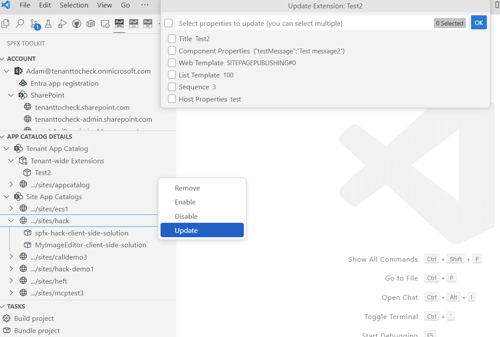
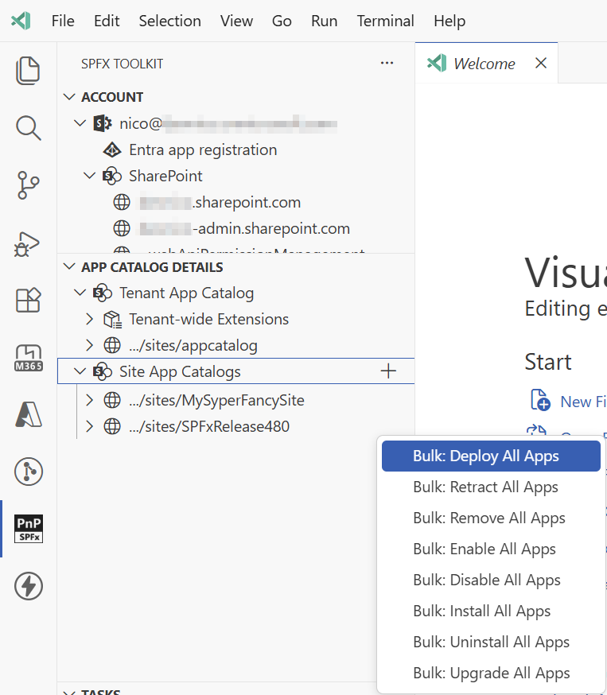

SharePoint Framework Toolkit provides a set of management capabilities that allow you to manage your app catalogs and SPFx apps directly from VS Code.

## Environment details and tenant health

After signing in to your tenant, the extension will retrieve the environment details and helpful URLs from your tenant like link to: 

- SharePoint main site 
- SharePoint admin site
- SharePoint web API permission management page

Additionally, the extension will check and retrieve tenant service health incidents that are currently happening in your tenant so that you gain quick insights on your tenant health.

## Tenant wide extensions management

SPFx Toolkit will also check your tenant for any tenant-wide extensions that are currently deployed. If there are any, it will display them in the app catalogs details view. You can then perform actions on those extensions like:

- **Remove**: Removes the tenant wide extension from the tenant wide extension list. It does not remove the SPFx package from the app catalog.
- **Enable**: Enables the extension on your tenant.
- **Disable**: Disables the extension on your tenant.
- **Update**: Allows to update all of the tenant-wide extension properties like: Title, Properties, Web template in which the extension will be present, List template, sequence and host properties.

## App Catalogs management

After successful sign in, an additional view is presented that shows a list of links to app catalogs available in the tenant, both tenant-level and all site-level app catalogs. The extension also allows you to add a new tenant-level app catalog if it does not exist yet as well as site-level app catalogs.

You can expand each app catalog to reveal the list of apps contained within. Selecting an app navigates you to its details page. Additionally, hovering over an app node presents a set of actions, allowing you to perform various operations directly on the selected app.

- **Deploy**: Makes the solution available for installation in sites but does not automatically install it.
- **Retract**: Reverses the deployment, preventing the solution from being installed in sites.
- **Remove**: Removes the app from the app catalog.
- **Enable**: Allows end users to add the solution to their SharePoint sites.
- **Disable**: Hides the solution from end users, preventing them from adding it to sites.
- **Install**: Install the solution from tenant or site collection app catalog to a site.
- **Uninstall**: Uninstall the solution from a site.
- **Upgrade**: Upgrades the solution to the latest version available in the app catalog for the specified site.
- **Copy**: Copies the solution to a different app catalog.
- **Move**: Moves the solution to a different app catalog.

### Bulk app operations

The extension provides bulk operation capabilities to help you manage multiple SPFx apps efficiently. These operations allow you to perform actions on all apps within an app catalog simultaneously.

Available bulk operations include:

- **Bulk Deploy**: Deploys all non-deployed apps in the specified app catalog.
- **Bulk Retract**: Retracts all deployed apps in the specified app catalog.
- **Bulk Remove**: Removes all apps from the specified app catalog.
- **Bulk Enable**: Enables all disabled apps in the specified app catalog.
- **Bulk Disable**: Disables all enabled apps in the specified app catalog.
- **Bulk Install**: Installs all apps from the specified app catalog to a site.
- **Bulk Uninstall**: Uninstalls all apps from a site.
- **Bulk Upgrade**: Upgrades all apps on a site to their latest versions available in the app catalog.

Each bulk operation displays a confirmation dialog and provides progress tracking with a detailed output window for monitoring the operations on individual apps.

