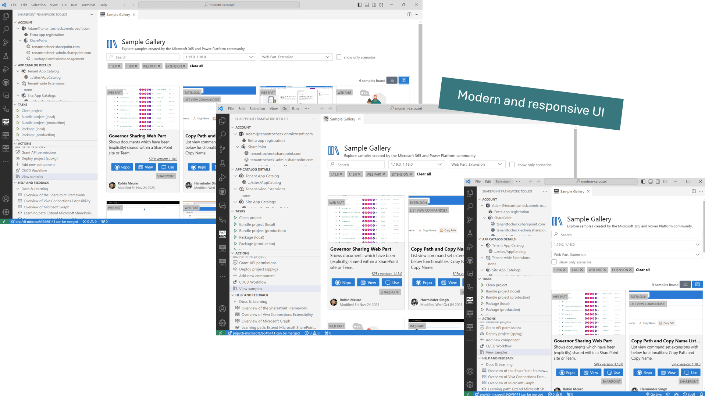

## 1. Scaffold a new SPFx project

SharePoint Framework Toolkit allows the creation of a new SPFx project using the same scaffolding steps as the official SharePoint Framework Yeoman generator but in form-based view.

It is possible to create any kind of SPFx project type.

Install additional dependencies with a single click straight from the scaffolding form. Currently we support installing [PnP reusable property pane controls](https://pnp.github.io/sp-dev-fx-property-controls/), [PnP reusable React controls](https://pnp.github.io/sp-dev-fx-controls-react/), [PnPjs](https://pnp.github.io/pnpjs/). Add and preconfigure [SPFx Fast Serve](https://github.com/s-KaiNet/spfx-fast-serve) and add a Node Version Manager configuration file either for NVM or NVS.

## 2. Don't start from scratch - sample galleries

Using the extension you may browse and pick a sample you are interested in and create a new project based on it. After you select the sample you will be asked to select the location where it will be downloaded and to give a new name for the project. After downloading and renaming VS Code will automatically open this project and run `npm install`.

The extension provides a set of filters to help you find the right sample for your needs. You may search by: author, title, description, SPFx version, and component type. It is also possible to browse sample details view directly from VS Code checking all sample details before you create a new project.

Switch between the list and grid view and don't worry about the size of your VS Code as it is fully responsive.

Check it out in action 👇

It is also possible to use sample galleries outside of the welcome experience view. When within an SPFx project in the Actions section you may find options to open the gallery view of each type.
