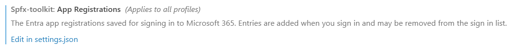
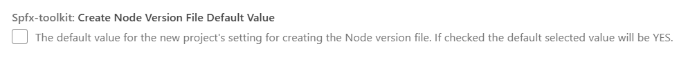
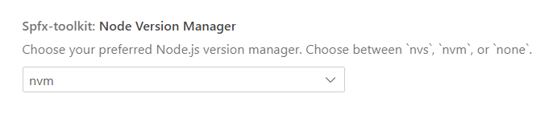
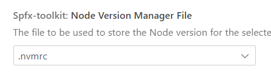
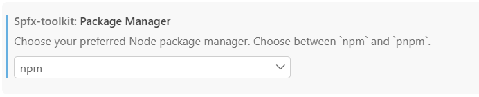
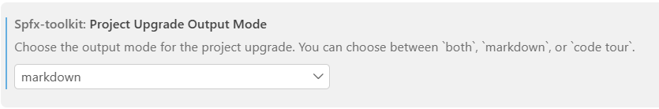
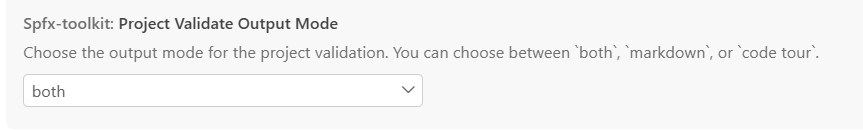
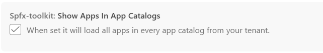
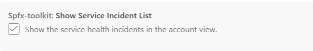
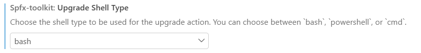

SPFx Toolkit has a few settings you can change to make it work the way you like.

To open them, go to **Settings** (`Ctrl+,` on Windows and Linux, `Cmd+,` on macOS) and search for `SPFx`. You can also go to **Extensions** > **SharePoint Framework Toolkit** in the settings list.

The settings below are listed in the same order as you see them in VS Code. If you prefer to edit `settings.json` directly, all setting names start with `spfx-toolkit.`.

## App Registrations

The list of Entra app registrations you used to sign in to Microsoft 365. SPFx Toolkit adds an entry each time you sign in, so next time you can pick it from the list instead of typing the IDs again. Learn more in [Sign in](../features/sign-in).

This setting applies to all your VS Code profiles. You can't change it directly in the Settings view. Select **Edit in settings.json** to change or remove entries. You can also remove entries from the sign-in list.

In `settings.json` it looks like this:

```json
"spfx-toolkit.appRegistrations": [
  {
    "name": "Default",
    "clientId": "00000000-0000-0000-0000-000000000000",
    "tenantId": "00000000-0000-0000-0000-000000000000"
  }
]
```



## Create Node Version File Default Value

When you create a new project, the form asks whether to create a Node version file. If you check this setting, that option is set to **Yes** by default.

- **Default:** unchecked (`false`)



## Node Version Manager

The tool you use to install and switch between Node.js versions. SPFx Toolkit uses it when it installs Node.js for you, when it creates a Node version file for a new project, and to switch to your project's Node.js version when it opens a terminal.

- **Values:** `nvm`, `nvs`, `none`
- **Default:** `none`



## Node Version Manager File

The file SPFx Toolkit creates in a new project to store the Node.js version. The `.node-version` file works only with `nvs`.

- **Values:** `.nvmrc`, `.node-version`
- **Default:** `.nvmrc`



## Package Manager

The package manager SPFx Toolkit uses to install packages and in the commands it gives you, for example in the project upgrade steps.

- **Values:** `npm`, `pnpm`
- **Default:** `npm`



## Project Upgrade Output Mode

How SPFx Toolkit shows the steps to upgrade your project: as a Markdown report, as a Code Tour, or both.

- **Values:** `both`, `markdown`, `code tour`
- **Default:** `both`



## Project Validate Output Mode

How SPFx Toolkit shows the results when it validates your project: as a Markdown report, as a Code Tour, or both.

- **Values:** `both`, `markdown`, `code tour`
- **Default:** `both`



## Show Apps In App Catalogs

When checked, you can expand each app catalog in the **App Catalog details** view to see its apps. Uncheck it if you only want to see the list of app catalogs.

- **Default:** checked (`true`)



## Show Service Incident List

When checked, SPFx Toolkit shows current Microsoft 365 service health incidents in the Account view.

- **Default:** checked (`true`)



## Upgrade Shell Type

The shell used for the commands in the project upgrade steps. Pick the one you use in your terminal.

- **Values:** `bash`, `powershell`, `cmd`
- **Default:** `powershell`


