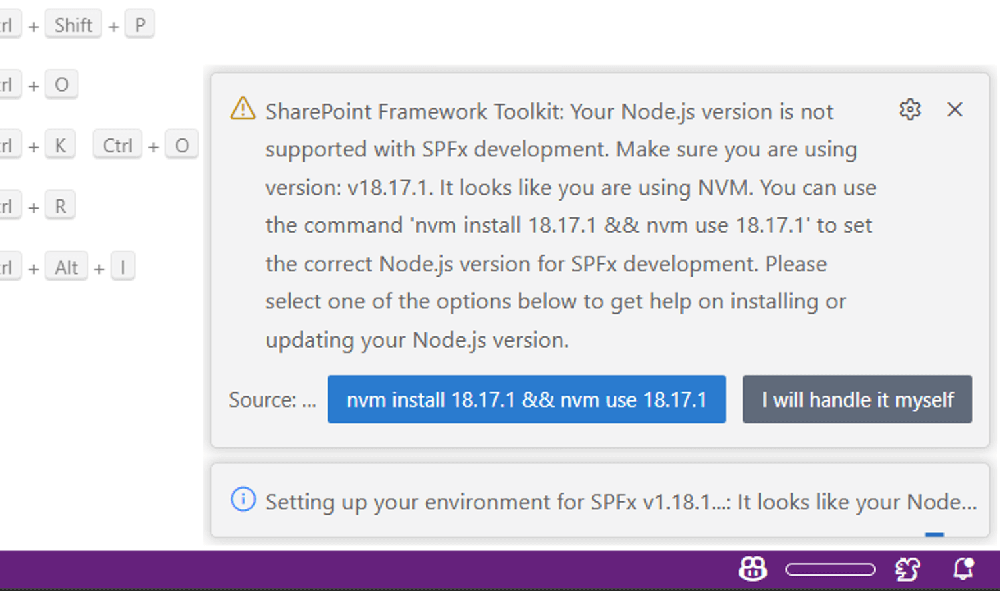

## Validate local setup

Usually the most important and the hardest part is always the setup of the local environment to ensure you are ready to start your work. SPFx Toolkit makes this step effortless by checking your local workspace for the needed global dependencies are installed and if not it will install them for you with a single click.

The extension will validate your setup for the SPFx generator version you have installed in your machine. In case you do not have any SPFx generator installed, it will validate against the latest SPFx version.
In case your Node.js version is not correct or you do not have the required global dependencies installed, SPFx Toolkit will fix that for you by running the install dependencies action.

## Install dependencies

If you are just getting started with SharePoint Framework development on a clean machine, you may use the "Install dependencies" button to install all the needed global dependencies in one go for any version of SPFx.

SPFx Toolkit may also help you install and switch to the correct version of Node.js using either `nvm` (Node Version Manager) or `nvs` (Node Version Switcher). First, you need to make sure you have set the Node.js Version Manager setting in SPFx Toolkit to either `nvm` or `nvs`.

Then, during dependency installation, SPFx Toolkit will check if you have the correct version of Node.js installed, and if not, it will offer to install and switch to the correct version for you using the selected Node version manager.

