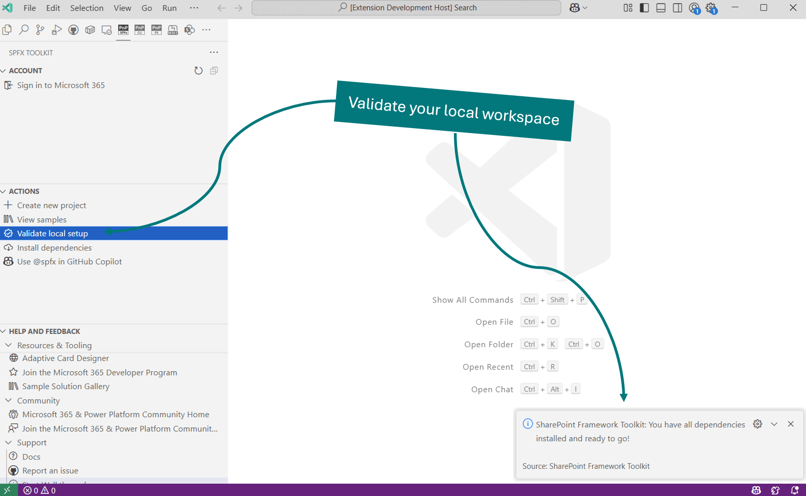

## Validate local setup

Usually the most important and the hardest part is always the setup of the local environment to ensure you are ready to start your work. SPFx Toolkit makes this step effortless by checking your local workspace for the needed global dependencies are installed and if not it will install them for you with a single click.

The extension will first check if you have Node.js installed and if the version you have is compatible with the latest version SharePoint Framework. If not, it will prompt you to install the correct version. 
Then it will check if you have gulp-cli, yeoman, and SharePoint Generator installed globally.

## Install dependencies

If you are just getting started with SharePoint Framework development on a clean machine you may use the "Install dependencies" button to install all the needed global dependencies in one go without any additional validation. This action will always install the dependencies overwriting the existing ones if you had any of them.