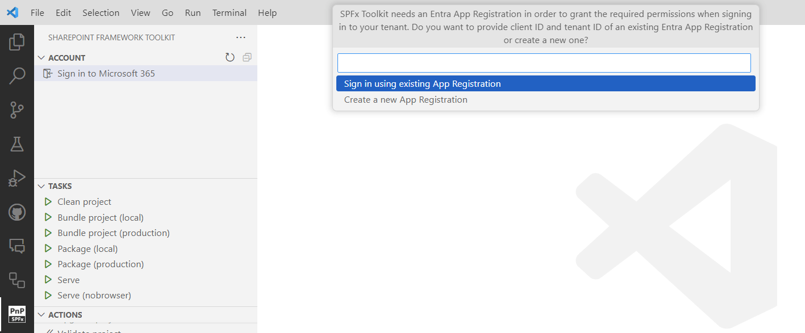
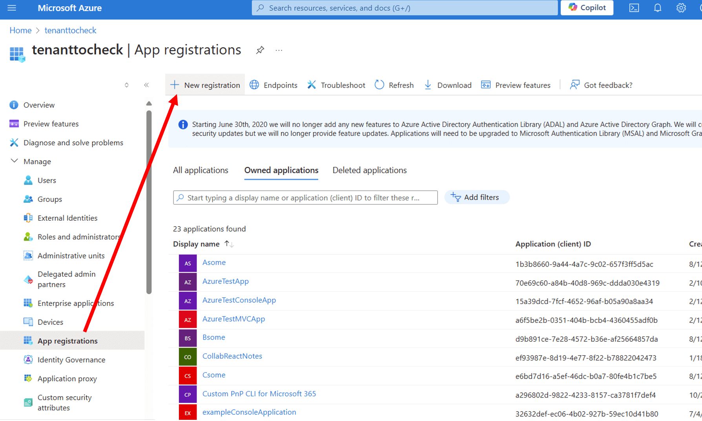
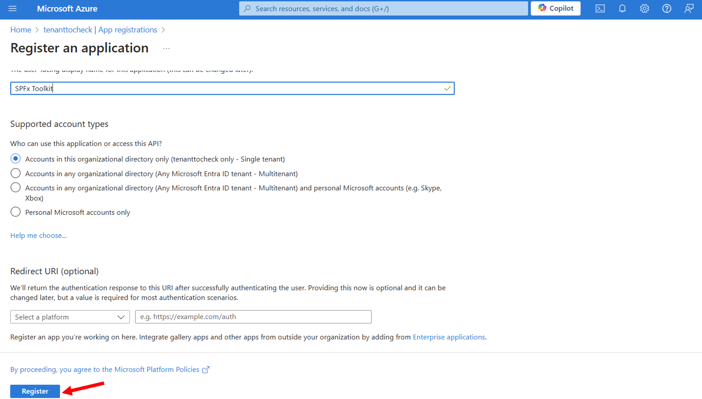
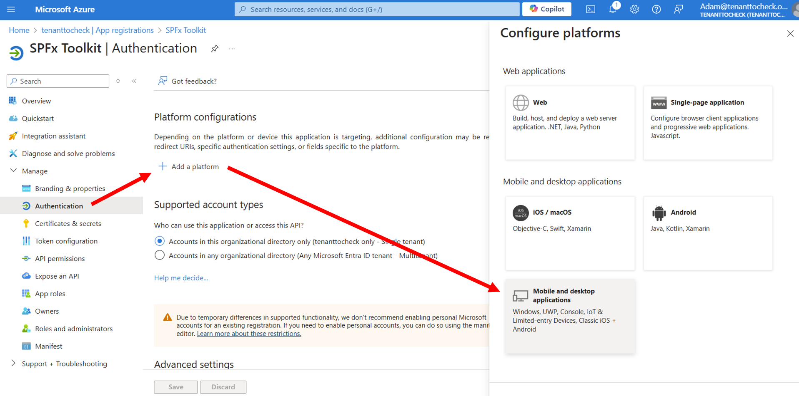
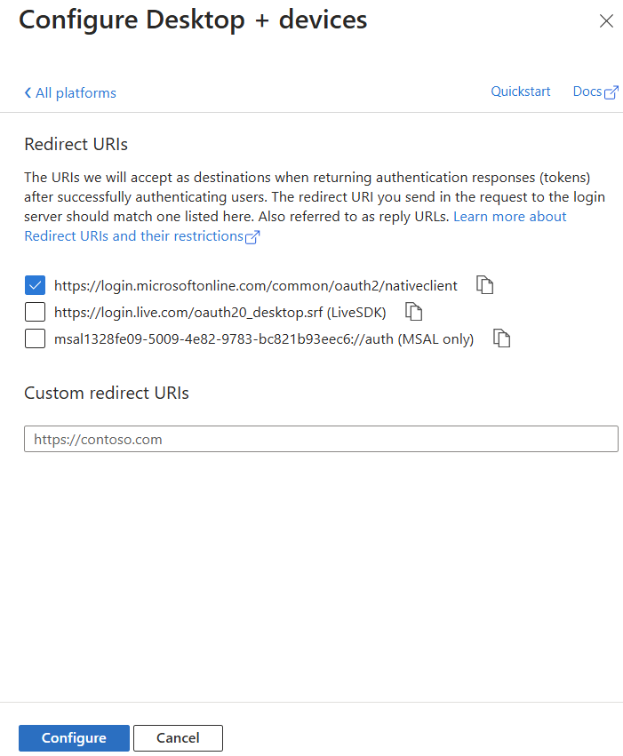
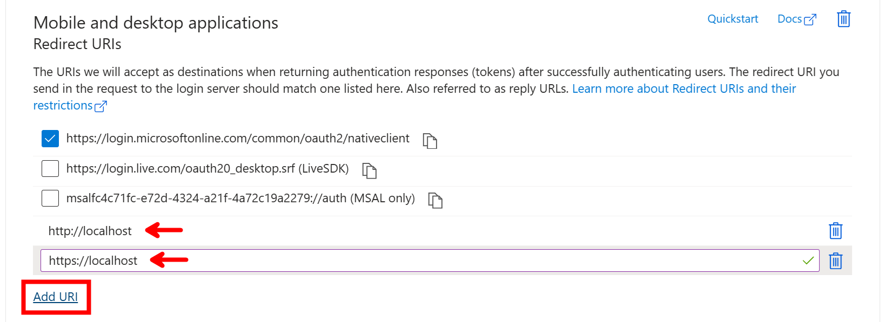
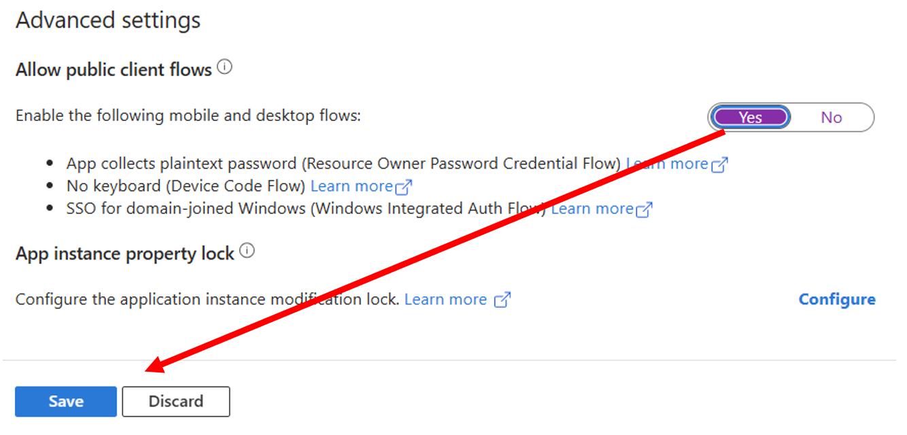
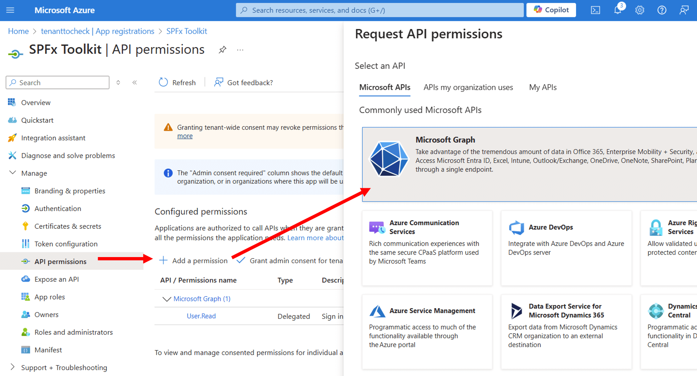

SharePoint Framework Toolkit requires you to sign in to your Microsoft 365 tenant to be able to perform some actions like deploying solutions to the tenant or site-level app catalog, managing app catalogs, and more. The sign-in process is simple and straightforward, allowing you to quickly get started with your SPFx development. You may use an existing Entra App Registration or create a new one with a single click. The extension will guide you through the process of signing in and configuring the app registration if needed. If needed, you may also perform the manual setup of the Entra App Registration.

## Sign in process

In order to sign in to your tenant you must have SPFx Toolkit opened in the context of a SharePoint Framework project. In the account panel you may use the `Sign in to Microsoft 365` button to start the process


Alternatively, you may use the `>SPFx Toolkit: Sign in to Microsoft 365` command to do the same

SPFx Toolkit needs an Entra App Registration to be able to sign in to your tenant. You may either use an existing app registration or create a new one with a single click using a dedicated form. 



SPFx Toolkit will guide you through the process of creating a new app registration either manually by providing step-by-step guidance or automatically by creating the app registration for you.


Check it out in action 👇


If you already have an Entra App Registration you may use it to sign in to your tenant by providing the Client Id and Tenant Id.


## Manual setup of Entra App Registration

If possible it is recommended to use the automated way to set up the SPFx Toolkit App Registration.
Otherwise please follow the manual steps to perform it manually (this is required only one time on each tenant)

- Navigate to the [Azure Portal](https://portal.azure.com/)
- Select Microsoft Entra ID from the global menu, select App Registrations in the Microsoft Entra ID blade and then select the New registration action button to open the Register an application form.



- In the form, enter a name for your new application. It's recommended to name this app SPFx Toolkit but you may give it any preferable name
- Leave the <code>Supported account types</code> and <code>Redirect URI</code> values as they are and select the <code>Register</code> button at the foot 
of the form to create your custom application



- Next we need to configure the <code>Authentication</code> for our new app. Go to the <code>Authentication</code> page and select the <code>Add a platform</code> button to open up the <code>Configure platforms</code> menu and under the <code>Mobile and desktop applications</code> heading, select <code>Mobile and desktop applications</code>. This will open another menu called <code>Configure Desktop + Devices</code> displaying a section called <code>Redirect URIs</code> and a list of checkboxes with some pre-defined URIs.



- Select the first option in the list, <code>https://login.microsoftonline.com/common/oauth2/nativeclient</code> and select the <code>Configure</code> button at the foot of the menu.



- Under Mobile and desktop applications, click on Add URI and enter the following redirect URIs:
    - http://localhost
    - https://localhost



- we can skip over the <code>Supported account type</code> section, as this is defaulted to <code>Accounts in this organizational directory only (tenant only - Single tenant)</code> meaning, that only users within the current tenant directory can use this application.
- In the <code>Advanced settings</code> section, we need to enable the <code>Allow public client flows</code> toggle, as we are using the <code>Device code flow</code> method to authenticate to our tenant using the CLI for Microsoft 365.



- To make sure all these changes are applied, select the <code>Save</code> button before moving on.
- Now that we have configured the application to work with the SPFx Toolkit, we next need to grant the required permissions. Select the <code>API permissions</code> in the menu option.



You will see a section called <code>Configured permissions</code> with one permission already granted. This is the default permission which allows the application to sign in the user account used when authenticating to the Microsoft Graph.

Add the following permissions:

```
    - Microsoft Graph:
        - AppCatalog.ReadWrite.All
        - AuditLog.Read.All
        - Directory.AccessAsUser.All
        - Directory.ReadWrite.All
        - SecurityEvents.Read.All
        - ServiceHealth.Read.All
        - ServiceMessage.Read.All
        - Sites.Read.All
        - User.Read

    - Azure Active Directory Graph
        - Directory.AccessAsUser.All

    - Azure Service Management
        - user_impersonation

    - Office 365 Management APIs:
        - ActivityFeed.Read
        - ServiceHealth.Read

    - SharePoint:
        - AllSites.FullControl
        - User.ReadWrite.All
```
        
- Go to <code>Overview</code> page and note down the <code>Application (client) ID</code> and <code>Directory (tenant) ID</code>
- Click on the <code>Sign in to Microsoft 365</code> and provide the noted down <code>Client Id</code> and <code>Tenant Id</code>

