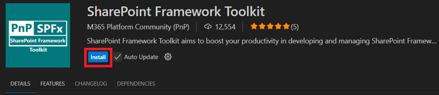
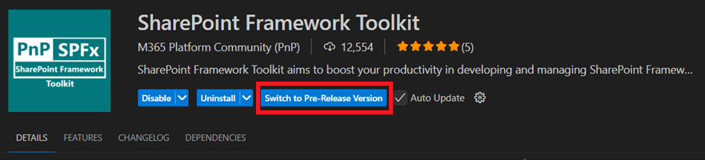
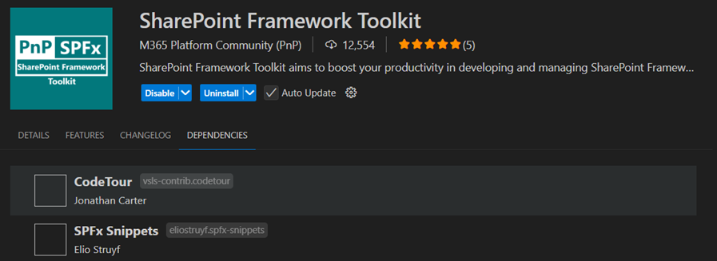

## 🎁 Download & Installation

👉 You can download the SPFx Toolkit extension from the [Visual Studio Marketplace](https://marketplace.visualstudio.com/items?itemName=m365pnp.viva-connections-toolkit) and install it in Visual Studio Code.

Watch this video to learn how to download and install the SPFx Toolkit, create your very first web part, and deploy it to your tenant, including the first login experience.

<iframe src="https://www.youtube.com/embed/cnSJ7xF9dzE?si=mCF7X2QTThMDgTts&amp;start=317" title="Getting Started with SharePoint Framework with SPFx Toolkit" allowfullscreen> </iframe>

---

## 🔖 Release vs. Pre-release Versions

### Release Version

The **release version** of the SPFx Toolkit is the **stable** version that is ready for production use and is available in the VS Code marketplace for easy installation. This version is released through the **main branch** and is triggered by the **main release pipeline**. A new release is created for each **major** or **minor** version update, including detailed changelog updates, release blog post, documentation, and a `.vsix` package for distribution.

### Pre-release Version

The **pre-release version** of the SPFx Toolkit is for testing **beta features** that are still in development. This version is available through the **dev branch** and is triggered by the **pre-release pipeline**. Pre-releases allow users to try out the latest features before they are officially part of the next stable release.

Once a **pre-release version** is available, you will be able to switch between the **release** and **pre-release** versions directly in VS Code. 

---

## 📦 Bundle with Other Extensions

The SPFx Toolkit extension comes bundled with two other useful Visual Studio Code extensions:

- **[CodeTour](https://marketplace.visualstudio.com/items?itemName=vsls-contrib.codetour)** by [Jonathan Carter](https://marketplace.visualstudio.com/publishers/vsls-contrib)
- **[SPFx Snippets](https://marketplace.visualstudio.com/items?itemName=eliostruyf.spfx-snippets)** by [Elio Struyf](https://marketplace.visualstudio.com/publishers/eliostruyf)

---

## 🐞 Found a Bug?

If you notice any bugs, please report them using our [bug report template](https://github.com/pnp/vscode-viva/issues/new?template=bug-report.yml).

---

## 💡 Feature Requests

Do you have an idea for a new feature? Please submit your feature request using our [feature request template](https://github.com/pnp/vscode-viva/issues/new?template=feature-request.yml).
