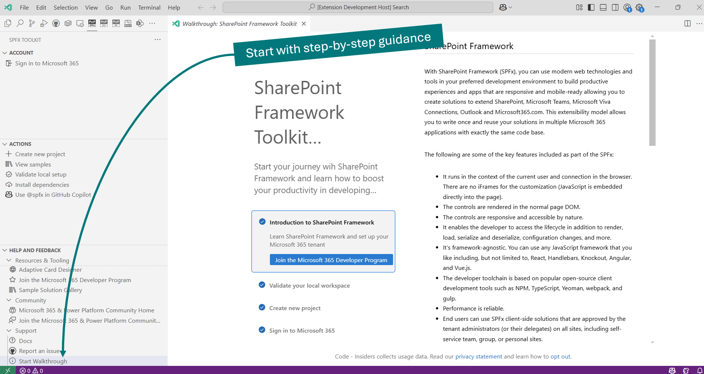

The extension automatically detects if you have a SharePoint Framework project opened. If not, it will start with a welcome experience that will guide you through the process of creating a new project and validating your local environment.

Directly from this view, you may create a new project from scratch or from an existing web part, extension or ACE sample, or ACE scenario.

Last but not least it is possible to check your local workspace for the needed global dependencies to develop the SPFx solutions, like the correct Node version, gulp, yeoman etc., and install them if needed with a single click.

You may also sign in to your Microsoft 365 tenant to gain access to the extension management capabilities allowing you to manage you app catalogs and deployed solutions.

## Walkthrough

When running the extension for the first time it will present you a walkthrough that will give you a step-by-step guide to get started with SharePoint Framework development and will go over the main functionalities of SharePoint Framework (SPFx) Toolkit.

